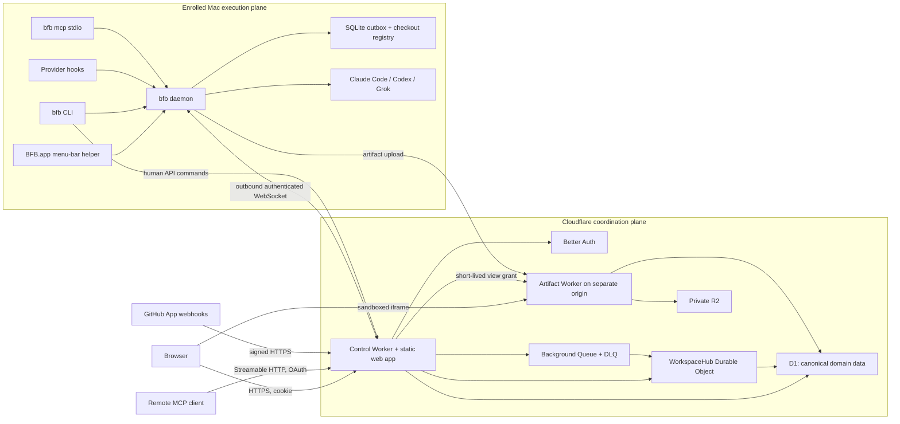
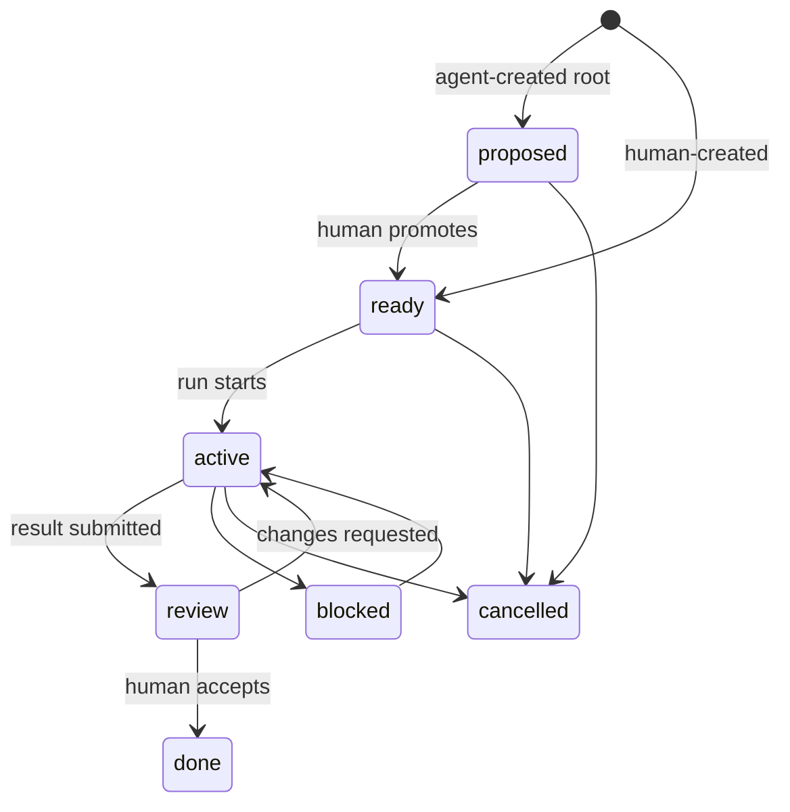

# BFB v0.1 architecture

Status: architecture draft for review, 7 August 2026

BFB is a provider-neutral control plane for humans and coding agents. It gives a small team one place to decide what needs attention, start an agent in an exact local checkout, observe the work live, exchange structured context, review evidence, and understand where human and agent time went.

The first release is designed for roughly 3 people, 10 projects, 5 named agent profiles, and multiple enrolled Macs. It is a real multi-user product from day one, but it is not a Jira replacement and it does not execute arbitrary cloud jobs.

## Product contract

The main loop is:

1. A human creates or promotes a task.
2. The human chooses an agent profile and a registered checkout, then presses **Start**.
3. The enrolled Mac opens the provider CLI in that exact checkout.
4. Hooks and explicit agent actions update BFB in real time.
5. Questions enter a cross-project attention inbox instead of disappearing in a terminal.
6. Plans, previews, diffs, and evidence are reviewed as immutable artifacts.
7. The agent submits a result explicitly; a human decides whether the task is done.

The attention inbox is the home screen. The project board is a secondary planning view. “What needs a person now?” matters more than “which column is every card in?”

Five rules shape the architecture:

- A **Task** is durable work, a **Run** is one attempt, and a **Provider Session** is the Claude Code, Codex, or Grok conversation behind a run. They are never collapsed into one record.
- Agent profiles are configuration, not identities. Every action is attributed to a human, runner, run-scoped agent, integration, or system process.
- Cloudflare coordinates; enrolled Macs execute. The cloud never receives a local provider credential and never sends a shell command.
- Hooks provide telemetry. MCP and CLI commands express intentional business actions such as requesting a review or submitting a result.
- Human attention is the primary efficiency metric. Tokens and estimated cost remain visible, but they are not treated as equivalent to human minutes.

## v0.1 boundary

### Included

- Team workspaces, invitations, roles, and project access.
- Projects, tasks, comments, agent-facing context, human notes, and links to GitHub objects.
- Named Claude Code, Codex, and Grok profiles with project-level allow/deny policy.
- An enrolled macOS runner, exact-checkout registry, one-click remote launch, durable short-lived delivery/claimed-launch recovery, and checkout occupancy protection.
- Live run presence, normalized provider events, attention requests, reconnect-safe history, and browser/macOS notifications.
- Agent elapsed time, observed active time, attention wait, token usage with provenance, and human review/intervention measurements.
- Markdown, Mermaid, diff, SVG, image, log, and self-contained HTML artifacts with review and approval.
- A human CLI, a local run-scoped MCP server, and a remote OAuth-protected MCP endpoint.
- A GitHub App for repository identity, pushes, pull requests, and CI/status evidence.
- Managed BFB Cloud and self-hosting into the operator’s own Cloudflare account from the same repository.

### Excluded

- Running coding agents inside Cloudflare or on BFB-owned compute.
- Arbitrary commands, arbitrary executable paths, or shell fragments sent from the server.
- Automatic cloning, pulling, resetting, branch switching, or rebasing on a runner.
- Automatic merge, deploy, or calibrated-autonomy rules.
- Full bidirectional synchronization with GitHub Issues or another ticket system.
- Raw prompt, transcript, source file, environment, or tool-output collection by default.
- Windows/Linux desktop applications, mobile applications, managed worktree creation, enterprise SAML/SCIM, billing, and marketplace features.
- JSX compilation, npm dependency installation, or a general application runtime for artifacts.
- Vector search, AI Gateway, Workers AI, Workflows, KV, and Analytics Engine.

## System topology



There are three distinct trust zones:

| Zone | Knows | Must not know |
| --- | --- | --- |
| Control plane | Tasks, policies, sanitized checkout labels, semantic events, usage, artifact metadata | Local provider credentials, arbitrary local paths, raw terminal transcripts by default |
| Mac execution plane | Absolute paths, installed binaries, provider credentials, process IDs, local raw events | Other workspaces or projects not granted to the runner |
| Artifact origin | One authorized artifact version and its bytes | Web session cookies, control APIs, other artifact objects |

The managed public shape is `https://bfb.<tld>` for the app, API, auth, and MCP; `https://artifacts.bfb.<tld>` for the cookie-less artifact service; and `https://launch.bfb.<tld>` only for Universal Link wake-up intents. Self-hosters substitute their own domains but preserve the separate artifact origin. No separate API hostname is needed in v0.1.

## Technology decisions

| Area | v0.1 decision | Reason |
| --- | --- | --- |
| Web UI | React + Vite, served by Workers Static Assets | One deployable app/API origin and a conventional component ecosystem |
| Control API | TypeScript + Hono in a Cloudflare Worker | Small routing layer, direct Cloudflare bindings, and shared TypeScript domain contracts |
| Relational data | One D1 database per environment; Drizzle schema and checked-in SQL migrations | Tenant-aware relational queries, constraints, and auditable migrations |
| Realtime coordination | One hibernating `WorkspaceHub` Durable Object per workspace | A serialized workspace command lane and reconnectable WebSockets without an always-running server |
| Object data | Private R2 | Immutable artifacts and compressed log chunks do not belong in D1 |
| Background work | One typed Queue and one dead-letter queue | GitHub processing and notifications may be retried and need not block user commands |
| Human auth | Better Auth `1.6.26`, pinned exactly for the first implementation | GitHub sign-in, passkey step-up, device authorization, OAuth provider, and API keys; BFB owns authorization records |
| Local runtime | One Go `bfb` binary | A small, distributable daemon/CLI with reliable process, socket, SQLite, and macOS integration primitives |
| macOS shell | A thin native SwiftUI menu-bar application | Native Universal Links, Keychain, notifications, and app lifecycle without duplicating daemon logic |
| Wire contracts | Versioned JSON Schema with generated TypeScript and Go types | Language-neutral event, command, and MCP contracts with cross-language golden tests |
| Repository | One AGPL-3.0 monorepo | The local runner and hosted coordination behavior remain inspectable and self-hostable |

Workers Static Assets is preferred over Pages because the assets and Worker can be deployed and routed together. Only `/api/*`, `/auth/*`, `/mcp`, `/realtime/*`, `/runner/*`, `/webhooks/*`, and OAuth discovery paths run Worker code first; all other requests use asset-first SPA routing. See Cloudflare’s [Static Assets routing](https://developers.cloudflare.com/workers/static-assets/routing/worker-script/) and [SPA routing](https://developers.cloudflare.com/workers/static-assets/routing/single-page-application/) documentation.

The Go daemon plus thin Swift app is intentional. A Tauri desktop application would introduce a second substantial desktop runtime while the daemon would still be required for hooks, headless CLI use, process supervision, and local MCP.

## Domain model

### Tenancy and configuration

A BFB **Workspace** is an application-owned authorization boundary. Better Auth owns global human identity and sessions; it does not own workspace/member/invitation state in v0.1. BFB’s authorization service is the only mutation path for workspaces, memberships, invitations, roles, project grants, revocation epochs, and their audit/outbox effects, which commit in one workspace command. Every tenant-owned domain row includes `workspace_id`; globally scoped identity, bootstrap, and abuse-control rows are explicit exceptions. Projects can be visible to all workspace members or restricted with explicit project grants.

Configuration is evaluated in this order:

1. Workspace policy sets hard ceilings: allowed providers, retention, launch permissions, and artifact rules.
2. Cloud project policy tightens those ceilings for a repository or client.
3. An optional version-controlled `.bfb/config.yaml` may tighten policy and provide non-secret defaults; it can never widen cloud policy.
4. The selected agent profile supplies provider, model, execution mode, and harness defaults.
5. Runner capabilities remove options that are unavailable locally.
6. A run override may select among the remaining allowed options.

The effective configuration is stored as an immutable JSON snapshot and SHA-256 hash on every run. Historical events and approvals therefore remain interpretable after settings change.

The daemon reports the canonicalized `.bfb/config.yaml` and its hash when a checkout is linked or changed. Launch request preflight uses the last reported version, but the daemon reads it again immediately before execution. If the hash changed, the claimed specification becomes unusable: the daemon submits the tighter repository constraints, the hub creates a replacement immutable config snapshot/specification under the same still-valid claim, and final authorization runs again before execution. A locally discovered restriction can block a launch; stale cloud state can never widen local repository policy or silently mutate an existing snapshot.

Repository configuration never contains credentials, absolute paths, or duplicated human/agent instruction files. BFB does not rewrite `AGENTS.md`, `CLAUDE.md`, or equivalent harness configuration.

### Work records

| Record | Meaning | Important invariants |
| --- | --- | --- |
| Project | A repository or monorepo workspace and its BFB policy boundary | Cloud identity uses immutable host repository ID where available plus normalized workspace-relative subpath, not a local path |
| Task | Durable desired outcome | Agent-created root tasks begin as `proposed` |
| Run | One attempt to execute a task | Captures configuration, checkout, requester, provider profile, executions, sessions, and immutable result submissions |
| Provider session | One harness conversation within a run | Requested ID, where supported, is distinct from the ID actually observed and bound by a trusted hook/event |
| Attention request | A specific clarification, review, credential/capability need, destructive-action approval, or blocker | Kind, required permission, open/answered state, and referenced immutable object are explicit; none is inferred from a stopped turn |
| Artifact | A logical review object | Format and semantic role are separate |
| Artifact version | Immutable bytes plus provenance | Content hash never changes; approval targets a version, not an artifact name |
| Review | Human decision on an artifact version or code revision | A later version invalidates the visual indication of approval |
| Event | An immutable semantic fact from a typed source | Idempotent, ordered by a workspace-local server cursor, and attributable |

### State machines

Tasks use a small workflow:



An agent may create child tasks under a human-rooted task according to project policy. It may not silently create a backlog of ready root tasks.

Run result, local execution attachment, and live activity are separate fields:

- `run.result_state`: `open`, `submitted`, `changes_requested`, `accepted`, `failed`, or `cancelled`.
- `execution.state`: `queued`, `launching`, `attached`, `detached`, or `ended`.
- `execution.end_reason` when ended: `launch_blocked`, `launch_expired`, `process_exit`, `terminated`, or `lost`.
- `run.activity`: `working`, `needs_human`, `waiting_user_submit`, `waiting_external`, `idle`, `offline`, or `unknown`.

`offline`, `detached`, and a stale heartbeat do not mean failure. A provider `Stop`, a failed tool, terminal close, or `SessionEnd` does not submit or accept a result. `bfb_submit_result`, `bfb run submit`, or an unambiguous successful headless exit creates an immutable result submission and moves the task to review; it does not assert that an interactive provider process has ended. Human acceptance moves the run result to `accepted` and the task to `done`.

An unfinished detached provider session resumes into the same run. A new run is a deliberate new attempt. Changes requested reopen the same run and produce a new result submission later. A submission binds its evidence, Git state, artifact versions, and configuration hash; later repository or artifact changes mark it outdated rather than rewriting its history. Once a result is accepted, agent MCP write capabilities are revoked, although BFB cannot prevent a human from typing into a still-open third-party terminal. The checkout lease therefore remains until verified process exit.

Launch commands use `pending`, `claimed`, `started`, `rejected`, or `expired`. Interactive commands expire two minutes after creation; reconnecting later requires another click. Claim is atomic and idempotent and rechecks human membership, project/provider policy, runner project and named-human launch grants, checkout registration, cancellation, and snapshot validity. A cloud checkout lease is acquired atomically with claim and is released only after verified process exit or explicit recovery that also proves no local process/lock remains.

A rejected, blocked, or expired launch leaves the run result `open`, ends that execution record with its typed reason, and puts the task back in a startable state. If no provider session ever attached, another click may create a new launch/execution record under the same run; once provider work began, another independent attempt is a new run while resume reattaches the same unfinished run.

### Human and agent data

Task context is stored as typed context items with audience `human`, `agent`, or `both`:

- Agent-facing context contains the task brief, acceptance criteria, constraints, accepted plan, relevant decisions, and safe resource links.
- Human-facing data adds internal notes, activity summaries, attention history, provenance, and review state.
- Humans with project access can inspect agent-facing context. Agents receive only the scoped agent view through MCP; they cannot scrape the human UI or enumerate the workspace.
- A secret reference may name a local credential slot, but the secret value never becomes task context.

Every `bfb_get_context` response has an immutable `context_version`, canonical hash, generation time, and run binding. The delivered version/hash is recorded on the run; later edits produce another version and an event rather than changing what history says the agent saw. Current authorization is checked on every retrieval, so an approved launch does not preserve context access after revocation.

The “latest work” view is a projection of committed semantic events, comments, explicit progress reports, artifacts, GitHub evidence, and reviews. BFB never constructs a success summary by scraping terminal prose.

## Cloudflare coordination plane

### Control Worker

The Control Worker serves four surfaces on one trusted origin:

- The static web application and same-origin REST API.
- Better Auth routes and OAuth discovery/authorization endpoints.
- Streamable HTTP MCP at `/mcp`.
- Browser and runner WebSocket upgrades, GitHub webhooks, and internal Queue consumption.

REST remains the durable read/write interface. WebSockets are a low-latency notification channel, not the source of truth. Every mutating REST, MCP, runner, and webhook command carries an idempotency key. Collection reads use cursor pagination; conflicting edits use a version field and conditional update.

### D1

D1 is canonical for:

- Workspace/project configuration and authorization data.
- Tasks, runs, provider sessions, attention requests, comments, reviews, and GitHub links.
- The append-only semantic event ledger and current projections.
- Exact measurements reported by a provider or observed by the runner.
- Artifact metadata, content hashes, and R2 object keys.
- Launch command recovery, notifications, webhook deduplication, and security audit records.

BFB is event-assisted relational software, not a pure event-sourced system. Normal relational records are the query model. Significant changes also append an event in the same atomic D1 batch. `version` columns and conditional transitions prevent lost updates. The entire validated batch commits or none of it does.

Projection updates are absolute, version/sequence-guarded upserts; they never blindly increment a counter after `INSERT ... ON CONFLICT DO NOTHING`. Measurements are uniquely inserted observations and totals are derived from them. Under the serialized hub lane, an existing idempotency/source-stream record returns its stored result before a new cursor/projection batch is built. Transport replay is idempotent through `(workspace_id, source_stream_id, source_sequence)` and the persisted BFB event ID. Each workspace has its own server-assigned monotonic event cursor, allocated with the new event while its hub serializes the write; clients never observe another tenant’s activity or use this cursor to acknowledge a runner stream.

One database is used per local, staging, and production environment. Read replicas and tenant-per-database sharding are not part of v0.1.

### WorkspaceHub Durable Object

The workspace record stores the deployment’s jurisdiction. From the first request onward, the Worker resolves the hub through the jurisdiction-specific namespace, for example `env.WORKSPACE_HUB.jurisdiction("eu").idFromName(workspace_id)`. The same name must never be resolved once globally and once in the EU namespace because those are different objects. There is one hub per workspace—not one global hub, one hub per socket, or one hub per run. Cloudflare documents this namespace behavior in [Durable Object data location](https://developers.cloudflare.com/durable-objects/reference/data-location/).

The hub has four jobs:

1. Serialize every BFB domain/authorization/audit workspace mutation and maintain the workspace’s live socket registry.
2. Validate commands/events and commit their relational change, semantic event, projection, and workspace cursor to D1 in one batch.
3. Broadcast small `event_committed` messages to authorized browser and runner sockets.
4. Opportunistically nudge online runners when a durable launch command or cancellation is available.

After authentication/authorization at the Control Worker, REST, MCP, runner, artifact-metadata, membership, and Queue domain mutations invoke the hub’s typed RPC. Reads go directly to D1. Ephemeral capability consumption—rate buckets, one-time challenges, and upload/view grants—uses a direct conditional D1 batch that rechecks the bound authorization epoch, consumes the capability, and inserts its durable audit-outbox row atomically; the hub later commits the corresponding audit event. Resource versions, allowed-state predicates, and idempotency constraints remain mandatory because retries and external effects still occur. Better Auth’s global identity/session operations are outside this lane; BFB workspace authorization records are inside it. A nudge is never considered delivery: runners pull pending commands on connection, on every active heartbeat, and periodically while online.

Durable Object requests can interleave while awaiting external D1 I/O. `WorkspaceHub` therefore puts the complete read/validate/D1-batch/response mutation path behind an explicit per-instance FIFO promise queue. It does not use `blockConcurrencyWhile` for external I/O. D1 uniqueness, versions, allowed-state predicates, and idempotency records remain the authoritative backstop, and concurrency tests deliberately delay D1 calls to prove cursor/state ordering.

It uses the [Hibernation WebSocket API](https://developers.cloudflare.com/durable-objects/best-practices/websockets/) and serialized socket attachments/tags so it can recover identity after eviction. Durable Objects provide coordination, not durable history; D1 remains authoritative.

The runner event path is:

```mermaid
sequenceDiagram
    participant H as Provider hook
    participant D as Mac daemon
    participant W as Control Worker
    participant O as WorkspaceHub
    participant DB as D1
    participant U as Browser

    H->>D: bounded provider event
    D->>D: normalize and commit to SQLite outbox
    D-->>H: acknowledge quickly
    D->>W: event batch + stream ID + source sequence
    W->>O: authenticated ingest
    O->>DB: guarded event inserts + absolute projections
    DB-->>O: workspace cursors + event dispositions
    O-->>D: per-event status + contiguous committed sequence
    O-->>U: event_committed workspace cursor
    D->>D: clear committed rows; quarantine terminal rejects
    U->>W: replay committed workspace events
```

The daemon creates a durable random `source_stream_id` per workspace runner enrollment and local database epoch. Every response gives each submitted event one disposition: `accepted`, `already_committed`, `retryable`, or `permanently_rejected`, with a bounded diagnostic code. Accepted/already-committed rows are removed; retryable rows remain queued; permanently rejected rows move to a bounded local quarantine and create a visible integration diagnostic instead of blocking the stream forever. A contiguous committed sequence is an optimization, but only an explicit event disposition can delete or quarantine its row; a workspace replay cursor can never do either. Independently executed duplicate hooks may remain as two observations when the provider supplies no stable event ID, but transport retries of one persisted BFB event have exactly one database effect.

Browser resynchronization avoids a replay/subscribe race: connect the WebSocket first, receive the hub’s D1 high-water cursor, buffer live invalidations, replay HTTP events after the client cursor through that high-water mark, then drain/fetch the buffered cursors. A higher committed cursor is an invalidation to replay; the compact WebSocket summary is not durable state.

### Presence

The daemon emits a process/session heartbeat every 15 seconds while an agent process is alive and less frequently while idle. Heartbeat proves only runner connectivity and process presence. `working` requires an open normalized turn/activity interval; a live TUI waiting at its prompt is `idle` or `activity unknown`. After 45 seconds without a signal the UI changes connectivity to “signal stale” or “runner offline” without changing the run result. These thresholds are presentation policy, not completion rules.

Human presence is not presented as exact work time. “Reviewed 20 minutes ago” comes from a committed review record. General browser activity is labelled as observed interaction, not proof of continuous attention.

### Queues

One typed Queue handles retryable, order-independent background jobs:

- GitHub webhook expansion and reconciliation.
- Browser push and macOS notification delivery bookkeeping.
- Artifact metadata validation and optional preview preparation.
- Periodic repository/status synchronization requested by a user.

A dead-letter queue receives jobs that exhaust configured retries. Queue delivery is at least once and may be out of order, so messages contain bounded IDs rather than domain bodies, every handler has a stable job ID, and every effect is idempotent. Consumers isolate each message with its own `try/catch` and call per-message `ack()` or `retry()` so one failure does not replay a whole successful batch. The dead-letter queue is monitored rather than treated as archival storage. Cloudflare documents these guarantees in [Queues delivery guarantees](https://developers.cloudflare.com/queues/reference/delivery-guarantees/) and [batching/retries](https://developers.cloudflare.com/queues/configuration/batching-retries/).

Queues never order run events, store canonical commands, or replace the D1 launch-command table.

A small Cron trigger dispatches durable integration/audit outbox rows, retries missed runner/notification nudges, reconciles stuck artifact uploads, and applies retention policy to independently keyed raw log chunks. Queue delivery alone is not a scheduler. Physical garbage collection of shared content-addressed artifact blobs is deferred in v0.1.

### R2 and the artifact origin

R2 is private. Objects are content-addressed within a workspace:

```text
workspaces/<workspace-id>/artifacts/sha256/<content-hash>
workspaces/<workspace-id>/runs/<run-id>/logs/<chunk-id>.jsonl.zst
```

Metadata and authorization remain in D1. Through the WorkspaceHub, the Control Worker authorizes one artifact version and creates a non-secret random `view_id` plus a high-entropy, short-lived, single-use `view_secret` for the current human session, authorization epoch, exact artifact version/content hash, and per-view nonce; D1 stores only the secret hash. The browser loads `https://artifacts.bfb.<tld>/view/<view-id>` in a sandboxed iframe and transfers the secret over the one-time `MessageChannel`. A fixed BFB-authored bootstrap document submits it in a bounded POST body to `/view/<view-id>/redeem`. Before returning any artifact bytes, one conditional D1 batch rechecks the current membership/epoch and exact version, consumes the grant, and inserts its durable audit-outbox row. The secret never appears in a URL, referrer, browser history entry, edge request path, or application log. Reload requests a new grant; audit uses only the non-secret view ID.

R2 and D1 cannot commit atomically. Artifact publication therefore uses an explicit state machine:

1. One WorkspaceHub batch creates an `artifact_version` row in `uploading` state and a hashed one-time upload grant bound to principal/grant, authorization epoch, workspace, run, artifact-version ID, format, declared size, expected digest, and expiry. The plaintext secret is returned once.
2. Before accepting bytes, the Artifact Worker uses one conditional D1 batch to recheck the current epoch and row state, consume the grant, and insert a durable audit-outbox row. A failed authorization or replay accepts no body/effect.
3. The Artifact Worker streams/bounds the body, validates declared format against detected MIME, computes and verifies SHA-256, and conditionally writes the content-addressed key with `If-None-Match: *` semantics. Callers never select a bucket key.
4. If the object already exists, verify its size/checksum metadata instead of overwriting it.
5. Send an authenticated finalize command through the WorkspaceHub to move the D1 row to `available`; only available versions can be viewed or reviewed.
6. The recovery Cron marks abandoned rows failed. It may report unreferenced artifact bytes but does not physically delete shared hash keys in v0.1.

R2 object names are content-addressed, but R2 itself is not assumed immutable. BFB has no overwrite path for an available hash and no v0.1 artifact-blob delete path, avoiding a stale garbage-collection decision racing a same-hash publication. See the [R2 conditional operations](https://developers.cloudflare.com/r2/api/workers/workers-api-reference/).

For v0.1 the Artifact Worker accepts bounded uploads through its R2 binding. Product limits are 5 MiB per review artifact and 1 MiB per compressed log chunk. Multipart and presigned large uploads are deferred until real usage requires them. Viewer bootstrap and artifact responses use `Cache-Control: private, no-store` and `Referrer-Policy: no-referrer`; view secrets are short-lived, single-use, stored only as hashes, and never logged.

### Environments and deployment

Local, staging, and production have separate Workers, D1 databases, R2 buckets, Durable Object namespaces, Queues, OAuth applications, keys, and secrets. Cloudflare bindings and secrets are not assumed to inherit between environments.

Wrangler configuration and checked-in D1 migrations are the deployment source of truth. v0.1 uses Cloudflare’s current declarative `exports` configuration to declare `WorkspaceHub` as a Durable Object with SQLite storage and its binding; it does not also declare a legacy migration tag. A clean account must not depend on a manually created namespace. A future conversion from/to legacy migration declarations requires its own reviewed migration plan. Durable Object lifecycle changes use `wrangler deploy` and are never gradually deployed across incompatible class/storage versions. Cloudflare’s declaration/migration behavior is covered in [Durable Object migrations](https://developers.cloudflare.com/durable-objects/reference/durable-objects-migrations/).

CI runs generated-contract checks, TypeScript tests, Go tests, the web build, D1 migration checks, and security integration tests. D1 changes use expand/contract rollout: deploy code that tolerates both shapes, backfill, switch reads, and only then remove old fields in a later release. A D1 Time Travel bookmark/export is captured before a destructive migration. Worker rollback is not data rollback and may not cross a Durable Object lifecycle change; the [rollback limitations](https://developers.cloudflare.com/workers/versions-and-deployments/rollbacks/) are part of the release runbook. A tagged release builds signed/notarized macOS artifacts; a separate reviewed deployment job publishes Workers and applies migrations.

Jurisdiction is a deployment-level v0.1 choice because one production deployment shares one D1 database and R2 bucket. Managed BFB production provisions both in the EU jurisdiction; a self-hoster chooses its deployment jurisdiction before resource creation. Every workspace copies that fixed value so its Durable Object is always resolved through the matching jurisdictional namespace. Mixed per-workspace residency inside one deployment is not supported; a future second jurisdiction requires a separate control-plane deployment and migration design. Cloudflare documents the creation-time constraints for [D1 data location](https://developers.cloudflare.com/d1/configuration/data-location/) and [R2 data location](https://developers.cloudflare.com/r2/reference/data-location/).

These controls constrain where D1, R2, and the jurisdictional Durable Object run/store data. They must not be described as proof that TLS termination, an ordinary Worker invocation, Durable Object identifiers in diagnostics, or all log processing occurs only in the EU; Regional Services and logging boundaries are separate products and decisions.

Worker Secrets hold Cloudflare-side secrets in v0.1. Secrets Store is not a required dependency. Exact product measurements remain in D1 rather than Analytics Engine because sampling is incompatible with a usage ledger. Workers Logs and sampled traces are operational diagnostics only.

## macOS execution plane

### Components

The `bfb` Go binary has several entry points but one implementation:

- `bfb daemon` runs as a per-user `launchd` agent.
- Normal CLI commands act as a human client.
- `bfb hook ingest --provider <provider>` receives provider hooks.
- `bfb mcp stdio` exposes run-scoped MCP to a local agent.
- `bfb __launch <local-intent-id>` is the fixed terminal bootstrap command.

The daemon listens on a user-only Unix domain socket with mode `0600`. Its SQLite database uses WAL mode and stores checkout records, active sessions, process observations, unacknowledged events, pending artifacts, and cached non-secret metadata. OAuth/API credentials and the runner private key live in macOS Keychain; provider credentials stay in their provider’s normal local store.

`BFB.app` is a small signed/notarized SwiftUI menu-bar application. It owns Universal Link handling, first-run/browser pairing, runner status, native notifications, and opening the terminal bootstrap. It delegates all BFB protocol and provider logic to the Go daemon.

### Checkout registry

Each checkout is explicitly linked on the Mac and assigned an opaque `checkout_id`. Its local record contains:

- Runner and project IDs.
- Absolute registered project working directory and its detected Git root.
- Normalized Git remote fingerprint and Git common-directory identity.
- Filesystem resource identity where available.
- Canonical physical-worktree identity, project workspace-relative subpath, display label, default flag, and last validation time.

Only `checkout_id`, project/runner IDs, display label, normalized repository fingerprint, an opaque hash of canonical physical-worktree identity, branch/commit/dirty summary, availability, and validation time are synchronized. The absolute path remains local. SSH and HTTPS remotes for the same hosted repository normalize to the same repository identity; for GitHub the immutable GitHub repository ID is authoritative.

Before opening Terminal, the daemon preflights that the registered working directory still exists, resolves to the expected Git root/worktree and monorepo subpath, and matches the registered fingerprint. The `bfb __launch` helper repeats canonical-path, Git root/common-directory, repository fingerprint, workspace-relative subpath, local lock/fencing generation, and policy/config validation immediately before spawning the provider. It then changes to the exact registered working directory, which may be the Git root or a project subdirectory. That final observation supplies the run’s actual cwd, branch, HEAD, and dirty state. Neither check changes Git state. A mismatch produces a typed `launch_blocked` event instead of falling back to another checkout or the home directory.

The runner also verifies that an interactive user session is available and that the configured terminal integration passed its installation health check. BFB does not bypass a locked/login-window session or macOS Automation consent; it reports a typed blocked state and waits for the user to make the session available.

v0.1 permits at most one BFB-managed writing launch per canonical physical worktree, even if a path alias or duplicate checkout record exists. Linking rejects duplicate physical identity anywhere on the runner. If occupied, the user may choose another already-linked worktree, return to the existing session, or cancel. BFB does not silently create a worktree or force concurrent BFB writers; it cannot prevent a human or arbitrary untracked local process from editing the same files.

Concurrency has two guards:

- D1 atomically acquires a cloud lease with command claim, keyed by runner plus physical-worktree identity hash and carrying a fencing generation and TTL.
- `bfb __launch` remains as a BFB-owned supervisor, acquires a user-local lock keyed by canonical physical-worktree identity, starts the provider in an owned process group, and holds the lock until that entire group is proven gone.

The cloud preflight is advisory; those two acquisitions are authoritative. The daemon renews a cloud lease only while it can verify the supervisor PID/start time, owned provider process group, and local lock. Cloud TTL expiry never causes the Mac to ignore a still-live local lock. Provider exit alone is insufficient while a child in that group remains.

Supported interactive adapters have a tested no-daemonize/no-session-escape contract. The supervisor also watches observed descendants. If one escapes the owned process group, or process identity becomes ambiguous, it retains the lock, reports `containment_unknown`, and requires explicit local recovery after inspection; a persistent recovery marker continues to block BFB launches if the supervisor crashes. This is collision prevention among managed launches, not a macOS sandbox or a guarantee against deliberately evasive local code.

### One-click launch

The primary path is a durable server command plus a realtime nudge:

```mermaid
sequenceDiagram
    participant U as Human in BFB
    participant C as Control Worker
    participant DB as D1
    participant O as WorkspaceHub
    participant D as Mac daemon
    participant T as bfb __launch in Terminal
    participant P as Provider CLI

    U->>C: Start task with profile + runner + checkout
    C->>C: authorize and evaluate policy
    C->>O: typed start command
    O->>DB: run + snapshot + command + lease preconditions
    O-->>D: command ID nudge
    D->>C: claim request + device proof
    C->>O: reauthorize claim
    O->>DB: atomic command claim + cloud lease
    O-->>C: immutable typed launch specification
    C-->>D: immutable typed launch specification
    D->>D: preflight checkout and terminal session
    D->>T: shell runs fixed absolute bfb path + UUID
    T->>D: claim one-time local handle; register supervisor PID/start
    D-->>T: checkout record + typed execution config
    T->>D: request final online authorization
    D->>C: pre-exec authorization check
    C->>O: verify command + current epochs/policy
    O-->>C: authorized
    C-->>D: authorized
    D-->>T: authorized
    T->>T: revalidate, lock, chdir
    T->>P: spawn owned process group with allowlisted argv
    P-->>D: SessionStart hook
    D->>C: normalized session_started event
    C->>O: authenticated ingest
    P-->>T: provider process exits
    T->>T: wait until owned group is gone; restore PTY
    T->>D: verified group ended; release lock
```

If the daemon is briefly offline, the command remains in D1 only until its two-minute interactive TTL. Reconnection after expiry never opens a surprise terminal; the human presses Start again. The runner pulls pending commands on connect and heartbeat, so a missed Durable Object nudge cannot strand an online command. Claim and final pre-exec authorization both reject an expired/cancelled command or a revoked human, membership, project grant, runner grant, policy, checkout, or snapshot.

For managed BFB Cloud, the web app may additionally open an Apple Universal Link such as `https://launch.bfb.<tld>/l/<opaque-intent>` to wake the app signed with that Associated Domain. The durable command claim remains authoritative, so a WebSocket nudge and link open cannot create two launches. A generally distributed notarized application cannot claim arbitrary self-hosted domains: self-hosted installations use `bfb://launch/<opaque-intent>` unless the operator builds/signs an app with its own Associated Domain. Apple’s documentation explains why [Universal Links](https://developer.apple.com/documentation/xcode/allowing-apps-and-websites-to-link-to-your-content/) are preferred where available over a merely registered [custom URL scheme](https://developer.apple.com/documentation/Xcode/defining-a-custom-url-scheme-for-your-app).

The link contains only a random, short-lived, single-use intent. It contains no task text, local path, repository URL, branch, token, executable, or arguments. The intent is bound to the requesting human, workspace, runner, and device key.

The claimed launch specification is typed data:

```json
{
  "schema_version": 1,
  "launch_id": "01J...",
  "run_id": "01J...",
  "run_execution_id": "01J...",
  "assignment_generation": 7,
  "task_id": "01J...",
  "runner_id": "01J...",
  "checkout_id": "01J...",
  "agent_profile_id": "01J...",
  "config_snapshot_id": "01J...",
  "config_snapshot_hash": "sha256:...",
  "execution_config": {
    "provider": "codex",
    "mode": "interactive",
    "model": "workspace-approved-model",
    "effort": "high",
    "approval_policy": "on_request",
    "filesystem_policy": "workspace_write",
    "context_injection": "session_start_additional_context",
    "initial_turn_transport": "provider_prompt",
    "required_capabilities": ["hooks.session_start", "mcp.stdio", "prompt.initial_constant"]
  },
  "expires_at": "2026-08-07T12:00:00Z"
}
```

There is deliberately no `command`, `executable`, `cwd`, or `argv` field. The snapshot contains all immutable adapter inputs; the daemon verifies its hash and applies local capability/policy ceilings before mapping it to a tested local adapter manifest. A changed agent profile cannot alter an existing run.

Terminal.app’s automation path does invoke a shell. That shell receives only a fixed, locally installed absolute `bfb` path plus a strictly validated opaque local intent UUID; no server/task/checkout text enters the command. The `bfb __launch` supervisor running inside the Terminal PTY claims that UUID once, registers its PID, executable identity, and start time, repeats checkout/config/expiry validation, acquires the local lock, calls `chdir`, and spawns the provider in a new owned process group with explicit `execve` argv rather than shell interpolation.

For an interactive launch, the foreground supervisor temporarily blocks `SIGTTOU`, transfers the PTY foreground process group to the provider with `tcsetpgrp`, restores its signal mask, then waits without reading provider input; terminal-generated job-control signals naturally target the provider group. After that group is gone, it calls `tcgetpgrp` and restores foreground ownership only if the PTY still names that owned provider group, again blocking `SIGTTOU` around `tcsetpgrp`. It then reports the outcome and releases the lock. A remote BFB interrupt is a different path: the daemon verifies supervisor PID/start time and provider process-group identity before using `killpg`; escalation follows explicit local policy so PID reuse cannot target another process.

Context injection and starting the first turn are separate capabilities. A `SessionStart` hook may add constant BFB context without causing the provider to submit a turn. Where a tested provider version supports an initial prompt, the adapter sends only a constant instruction to load the run-scoped BFB context through MCP using that provider’s documented prompt or standard-input transport. Task text never enters the launch URL, shell command, or process list. If no safe initial-turn transport exists, launch reaches `waiting_user_submit` and the human submits the visible constant prompt; BFB never simulates keystrokes or labels that state `working`.

Terminal.app is the supported terminal target in v0.1. Other terminal adapters can be added only after they can preserve the fixed-bootstrap and no-shell-data invariants.

### Provider adapters

Each adapter implements:

```text
probe
capabilities
launch_interactive
launch_headless
resume
interrupt
terminate
normalize_hook_event
```

`probe` records the installed absolute binary path, version, integration hash, hooks, resume behavior, and runtime health. Supported flags and prompt transports come from a tested BFB capability manifest keyed by provider/version range; they are not guessed from `--help`. Unknown or newly auto-updated versions block automatic tracked behavior or require an explicit degraded launch until their fixtures pass. A server profile may select only capabilities in both the manifest and runtime probe.

| Provider | v0.1 launch rule | Notes |
| --- | --- | --- |
| Claude Code | Owned CLI process in the verified checkout | Use documented CLI launch/resume options and hooks; provider deep links are only a manual fallback because they do not provide deterministic checkout/session correlation. See [Claude Code CLI reference](https://code.claude.com/docs/en/cli-usage) and [hooks](https://code.claude.com/docs/en/hooks). |
| Codex | Owned CLI using the stable `--cd` option for the verified checkout | A trusted `SessionStart` hook binds the documented session ID and can add the constant BFB bootstrap context. `codex exec --json` supplies typed events and reported usage for headless runs. App links and experimental app-server WebSockets are not the control protocol. See the official [CLI reference](https://learn.chatgpt.com/docs/developer-commands?surface=cli), [hooks](https://learn.chatgpt.com/docs/hooks), and [non-interactive mode](https://learn.chatgpt.com/docs/non-interactive-mode). |
| Grok | Owned CLI with its documented working-directory support | Interactive mode may require the human to submit the first prompt where the installed version lacks a safe auto-submit contract; unattended starts use documented headless mode. See the [Grok CLI reference](https://docs.x.ai/build/cli/reference) and [headless scripting](https://docs.x.ai/build/cli/headless-scripting). |

No adapter simulates keystrokes. If a provider cannot safely accept the initial task automatically, BFB opens it in the exact checkout, shows the prepared context, and reports `waiting_user_submit` honestly.

`bfb provider setup <provider>` installs or updates only BFB’s supported user-level hook/MCP integration after explicit human approval; it preserves unrelated provider configuration and never rewrites project instructions. Hook commands point to a stable, signed app-owned launcher path rather than a versioned application-bundle path. Provider-specific provisioning registers the stdio MCP server, hook events, trust/review state, integration version, and configuration hash.

`bfb provider doctor` verifies binary version, absolute path, hook trust, duplicate/drifted configuration, MCP startup, Terminal Automation consent, and tested capabilities. BFB never uses a “bypass hook trust” option. A tracked launch requires healthy `SessionStart` correlation by default; an explicit, visibly degraded/untracked launch may be allowed by project policy and cannot remain silently stuck in `launching`. Captured official Codex behavior confirms that multiple matching hooks may run concurrently, so BFB normalization and local sequencing cannot assume its hook runs alone.

### Correlation, hooks, and offline operation

Each launch has three distinct identifiers:

- BFB `run_id`, created before launch.
- Requested provider session ID where a harness accepts one, plus the separately observed/bound provider session ID.
- A random, run-scoped local correlation capability.

The provider process receives only scoped BFB environment values such as `BFB_WORKSPACE_ID`, `BFB_PROJECT_ID`, `BFB_TASK_ID`, `BFB_RUN_ID`, `BFB_RUN_EXECUTION_ID`, `BFB_ASSIGNMENT_GENERATION`, `BFB_CHECKOUT_ID`, `BFB_CORRELATION_TOKEN`, and `BFB_ARTIFACTS_DIR`. Environment values are visible to tools run by the agent. The correlation token is therefore only same-execution correlation: it is bound to OS user, execution assignment, and provider session once observed, and it can originate only `agent_reported` telemetry. Daemon-observed process facts have separate provenance.

The MCP mutation capability is not placed in the general child environment. When `bfb mcp stdio` connects, the daemon verifies Unix peer UID, owned process group/ancestry, active run, and correlation, then creates an in-memory capability bound to that stdio connection. It can exercise only the documented run-scoped operations and is neither a human, runner, nor cloud bearer credential.

All provider hooks invoke the same bounded command. It reads one JSON payload from standard input, verifies the local correlation token and execution assignment, normalizes known fields, commits to SQLite, and returns quickly. Upload happens asynchronously. If the daemon socket is unavailable, the signed BFB hook binary validates against the user-only local assignment record and atomically writes a bounded, locally authenticated capture envelope into a user-only inbox; the restarted daemon imports it into SQLite. Disk limits, corruption, an invalid local authenticator, or an unwritable inbox produce a visible `telemetry_degraded` state rather than silent loss. Events without a valid BFB correlation are ignored rather than attached to a guessed run.

Execution end closes the event-creation window after a bounded final-hook grace period; it does not invalidate already captured outbox/inbox envelopes. Capture time, event ID, `run_execution_id`, assignment generation, and the local authenticator are persisted until the server commits or terminally rejects the event. Cloud replay is authorized by the current runner credential and the immutable historical execution assignment, not by resending an expired correlation token.

Telemetry events may queue offline. Business operations do not pretend they reached Cloudflare: attention creation, task mutation, artifact finalization, and result submission either return a durable `pending_sync` operation with its originating principal/grant, idempotency key, expected resource version, capture proof, and expiry or fail visibly as offline. Replay rechecks the current credential, authorization epoch, run capability, policy, and resource version; an operation that is no longer authorized becomes a visible terminal rejection rather than being applied under stale authority. Project policy may prohibit pending-sync result/review actions entirely.

The daemon-owned artifact outbox is outside the repository:

```text
~/Library/Application Support/BFB/runs/<run-id>/artifacts/
```

MCP publishing is preferred. The outbox watcher and `bfb artifact publish` are fallbacks. Symlinks, traversal, MIME mismatches, unsupported formats, and size violations are rejected before upload.

## Protocols and APIs

### REST and WebSocket surface

The stable HTTP namespace is `/api/v1`. Its resource groups are:

- `/workspaces`, `/members`, `/projects`, `/agent-profiles`, and `/policies`.
- `/tasks`, `/comments`, `/runs`, `/attention`, `/artifacts`, and `/reviews`.
- `/runners`, `/checkouts`, `/launches`, and `/events`.
- `/integrations/github`, `/notifications`, `/usage`, and `/audit`.

Browser WebSockets use `/realtime/workspaces/:workspaceId`; runner sockets use `/runner/connect`. The REST API returns current state and replay cursors. A WebSocket message contains a committed cursor and a compact event summary, never the only copy of a state change.

All BFB-issued resource IDs are opaque ULIDs. Provider session/turn/tool IDs and GitHub/integration IDs are bounded opaque strings stored only in provider-specific fields. Time is stored in UTC with the original provider occurrence time and the server receipt time. Every public response includes a schema version where it may be persisted by another component.

### Event envelope

Every normalized event uses the same envelope:

```json
{
  "schema_version": 1,
  "event_id": "01J...",
  "workspace_cursor": 1842,
  "source_stream_id": "01J...",
  "source_event_id": "provider-or-local-id",
  "source_sequence": 42,
  "workspace_id": "01J...",
  "project_id": "01J...",
  "task_id": "01J...",
  "run_id": "01J...",
  "run_execution_id": "01J...",
  "assignment_generation": 7,
  "provider_session_id": "optional",
  "actor": { "type": "agent_run", "id": "01J..." },
  "source": { "type": "runner", "id": "01J...", "provider": "claude" },
  "kind": "attention_requested",
  "occurred_at": "2026-08-07T11:59:58Z",
  "received_at": "2026-08-07T12:00:01Z",
  "payload": {}
}
```

The runner submits its persisted BFB event ID, source stream/sequence, `run_execution_id`, assignment generation, optional provider event/session fields, occurrence time, capture origin, kind, and typed payload. The server validates the execution and generation against the authenticated runner’s immutable historical assignment, so concurrent runs and delayed offline replay cannot be attached to whichever run happens to be active now. It derives workspace, project, task, and run from that assignment and rejects any claimed mismatch.

Actor is derived from the validated ingestion path and event kind, not asserted by the runner. A correlated provider hook or run-scoped MCP action may be `agent_run`; daemon-observed attachment, process, checkout, and heartbeat facts are `runner`; human and system events enter through their own authenticated command paths. A runner can never originate a human actor. The server assigns `received_at` and the committed workspace cursor after authentication.

Core kinds include launch requested/claimed/blocked/expired, execution attached/detached/ended, session started/resumed/ended, turn started/stopped/failed, tool started/finished/failed, progress reported, attention requested/resolved, subagent started/ended, context compacted, artifact published, result submitted/outdated/accepted, run failed/cancelled, and heartbeat.

Unknown provider payload fields are not copied into the cloud ledger. New semantic fields require a schema version and compatibility test.

### MCP

MCP represents deliberate agent actions, not every harness event. v0.1 exposes this small tool set:

| Tool | Effect |
| --- | --- |
| `bfb_get_context` | Return the current run’s scoped task, accepted plan, constraints, decisions, and safe links |
| `bfb_get_task` | Return one accessible task and its current state |
| `bfb_update_task` | Update permitted task fields with a version check |
| `bfb_add_comment` | Add a typed progress or discussion comment |
| `bfb_report_progress` | Publish a concise progress checkpoint and optional percent/confidence |
| `bfb_request_human` | Open a typed attention request with required permission and return its `attention_id` |
| `bfb_get_attention` | Read one request, its current state, answer, and resolution metadata |
| `bfb_wait_for_attention` | Wait through the local daemon for a bounded interval, then return answered or still-pending state |
| `bfb_publish_artifact` | Upload or register an immutable artifact version with format, role, and provenance |
| `bfb_propose_task` | Create a root `proposed` task or a policy-allowed child task |
| `bfb_submit_result` | Submit an immutable result summary, evidence IDs, known limitations, and Git/config snapshot for human review |

Every mutating tool accepts `request_id` for idempotency. Local agents use `bfb mcp stdio`; the daemon derives a capability limited to the active workspace/project/task/run. It cannot administer the workspace or access a human’s cloud credential.

A run-scoped agent cannot promote a proposed root task, edit human-only context, accept its own result, change policy/roles/integrations, launch another root run, or act outside policy-allowed child tasks.

`bfb_wait_for_attention` waits for at most 30 seconds per call and can be called again; it never holds a Cloudflare request indefinitely. An interactive agent continues automatically after a human answer only while it is actively waiting through this operation. Otherwise the answer is available on its next MCP call and a human may need to return to the terminal. Vendor-native permission dialogs are separate from BFB attention requests and cannot be answered remotely in a uniform, provider-neutral way in v0.1.

Remote clients use Streamable HTTP MCP at `/mcp`. The server publishes OAuth authorization-server and protected-resource metadata and supports preregistered clients plus HTTPS Client ID Metadata Documents under an SSRF-safe fetch/allow policy; open Dynamic Client Registration and authenticated end-user client CRUD are disabled in v0.1. Redirect URIs match exactly, Authorization Code uses PKCE S256 and `state`, and refresh tokens rotate on use.

Consent displays and binds one selected workspace, optional project/task/run boundary, the canonical BFB MCP resource, and explicit scopes such as `bfb:read`, `bfb:task:write`, `bfb:attention:write`, and `bfb:artifact:write`. The authorization endpoint creates the BFB-owned `oauth_delegation` before a Better Auth grant/token can become active. Better Auth is configured with `disableJwtPlugin: true`, hashed token storage, and client privileges that deny user client creation/update/deletion. v0.1 permits only authorization-code and rotating refresh-token grants for server-approved public clients; `client_credentials` and tokens without both a human principal and active delegation fail closed.

BFB validates the MCP resource, delegation boundary, and scopes on every call and rechecks current membership/authorization epoch for revocation. Tool handlers derive boundaries from the delegation and reject caller-supplied IDs outside them. Unauthorized responses include the protected-resource metadata URL in `WWW-Authenticate`. This follows the current [MCP authorization specification](https://modelcontextprotocol.io/specification/2025-11-25/basic/authorization) and the configured [Better Auth OAuth Provider](https://better-auth.com/docs/plugins/oauth-provider).

### CLI

The human-facing surface is intentionally scriptable:

```text
bfb login | logout | whoami
bfb daemon install | status | logs
bfb runner enroll | list | revoke
bfb checkout link | list | verify | unlink
bfb provider setup | doctor | list
bfb project list | show
bfb task list | show | create | move | comment
bfb run start | show | interrupt | cancel | submit
bfb attention list | answer
bfb artifact publish | list | open
bfb mcp stdio
```

Commands support JSON output and stable exit codes. Interactive output is concise. Destructive or privilege-expanding operations require an explicit flag and, where applicable, fresh human authentication.

## Authentication and authorization

### Human identity

Better Auth authenticates people and standard clients. BFB domain authorization decides what they may do in a workspace, project, task, or run.

v0.1 uses:

- GitHub OAuth for initial human sign-in.
- The Better Auth Passkey plugin for user-verifying step-up on privileged actions.
- Device Authorization to bootstrap the desktop/CLI login.
- The generic [OAuth 2.1 Provider](https://better-auth.com/docs/plugins/oauth-provider) for remote MCP clients.
- Scoped, expiring API keys for a human CLI session or approved CI integration.

The initial implementation pins Better Auth rather than following an unbounded semver range. The library’s D1 support and database model are documented in [Better Auth database concepts](https://better-auth.com/docs/concepts/database), and the [Device Authorization plugin](https://better-auth.com/docs/plugins/device-authorization) supplies the browser-assisted device flow.

The Better Auth Organization plugin is deliberately not enabled in v0.1: exposing its member/invitation mutation routes would create a second authority beside BFB’s workspace authorization service.

Better Auth owns credential issuance and protocol records; BFB owns every workspace/project/task/run authorization boundary behind those credentials. A Better Auth OAuth grant/token or API key is usable only while it references an active BFB-owned `oauth_delegation` or `api_key_binding` carrying that boundary, scopes, human/integration principal, expiry, and authorization epoch. The BFB record is created before the credential becomes active. Revocation disables the BFB record atomically with the workspace command before any asynchronous cleanup of Better Auth rows, so a cleanup failure cannot preserve authority.

Web sessions use secure, HTTP-only, same-origin cookies with exact trusted origins and `SameSite=Lax`. Session data stays in D1; cookie session caching is not enabled initially. Better Auth is configured with `account.encryptOAuthTokens: true`, secure cookies, exact trusted origins, and self-host telemetry disabled. CI verifies that GitHub tokens are not plaintext. Encryption and OAuth signing keys use `kid`-identified current/previous overlap during rotation; GitHub installation access tokens stay short-lived and out of D1/logs.

Sensitive actions—runner enrollment/sharing, integration changes, ownership changes, destructive/production-like policy changes, and high-impact attention approvals—require an action-bound nonce plus a fresh user-verifying passkey/WebAuthn assertion. Passkeys are configured with `userVerification: "required"`; a newly created cookie alone is not step-up authentication.

Ordinary Better Auth passkey-mutation routes are not exposed directly. Initial enrollment requires a fresh GitHub reauthentication and an action-bound enrollment nonce; subsequent additions or deletions require an assertion from an existing passkey. A user who owns a workspace cannot remove the final registered user-verifying authenticator. Recovery is an explicit operator flow, not automatic trust in a stolen session cookie. The underlying options are documented by the [Better Auth Passkey plugin](https://better-auth.com/docs/plugins/passkey).

Better Auth user deletion is disabled in v0.1. BFB authorization and audit references use `ON DELETE RESTRICT`, and no identity can disappear while it is an owner, grant principal, runner sponsor, or retained audit actor. A future deletion workflow must first enforce final-owner rules across every workspace and revoke all credentials/delegations through BFB; Better Auth’s underlying account behavior is described in its [users and accounts documentation](https://better-auth.com/docs/concepts/users-accounts).

No wildcard cookie is set for `*.bfb.<tld>`. The artifact origin therefore never receives a human session cookie. Accounts with the same email are not linked implicitly across OAuth providers.

Cookie-authenticated `/api/v1` mutations require an exact trusted `Origin`, Fetch Metadata checks, and a session-bound CSRF token. Browser WebSocket upgrades require the exact app origin. Credentialed CORS is disabled. CLI, runner, remote MCP, artifact upload/view, and webhook routes accept only their designated credential type and never fall back to a browser cookie.

BFB invitations contain a server-assigned workspace/role, exact normalized email, short expiry, and one-time secret. D1 stores only an HMAC/hash verifier; comparison is constant-time, consumption is atomic, and the raw secret is excluded from audit and operational logs. Acceptance requires an authenticated account with the matching verified email. v0.1 produces a copyable invitation URL; transactional email is not a hidden infrastructure dependency. The final owner cannot leave or be demoted. Removing a member atomically bumps the workspace authorization epoch, cancels their pending launches, revokes their workspace-scoped CLI/MCP/runner grants, and emits socket-revocation/audit outbox records.

### Roles and project access

| Action | Owner | Member | Reviewer |
| --- | --- | --- | --- |
| Manage workspace, members, policies, and integrations | Yes | No | No |
| Enroll own runner | Yes | Yes | No |
| Read assigned projects and activity | Yes | Yes | Yes |
| Create/promote/update tasks | Yes | Yes | No |
| Start, interrupt, or cancel runs | Yes, on a granted runner | Yes, on a granted runner | No |
| Answer clarification/review attention | Yes | Yes | Yes |
| Approve credential/capability/destructive policy action | Yes + step-up | Per policy + step-up | No |
| Comment, review, and approve artifacts | Yes | Yes | Yes |

Workspace role is necessary but not sufficient. A project restriction must also grant access. The workspace in `/w/<slug>` is resolved explicitly and current membership is checked; a cached “active workspace” UI preference is never treated as authorization.

A runner is private to its enrolling human by default. Using another person’s Mac requires an explicit named-human `runner_launch_grant` from that runner’s owner in addition to workspace role and project access; workspace ownership alone does not silently grant remote-launch authority. Shared/team machines use the same explicit grants.

Answering an attention request does not confer the permission needed for an underlying privileged action. A reviewer may explain a decision, but cannot satisfy a provider-policy change, credential operation, or launch approval that separately requires member/owner authority.

Artifact approval applies only to the reviewed version/hash and never elevates run, credential, launch, merge, or deployment permissions.

### Principal separation

BFB recognizes these principal types:

- `human`: a Better Auth user acting through web, CLI, or delegated remote MCP.
- `runner`: one workspace-scoped enrollment of one installation/device.
- `agent_run`: an ephemeral capability derived from one run.
- `integration`: GitHub or approved CI with explicit scopes.
- `system`: a named internal queue/maintenance action.

An agent profile is not a principal and cannot own a credential. A runner cannot impersonate the human who requested a launch. Audit records preserve both `requested_by_human_id` and `executed_by_runner_id`.

### CLI and runner enrollment

The CLI starts a device authorization flow. After the human approves it in the browser, a single BFB exchange endpoint first creates an `api_key_binding` for the human, selected workspace, optional project set, fixed scopes, expiry, and authorization epoch, then issues a prefixed, scoped, expiring credential through the API-key subsystem and revokes the bootstrap credential. Better Auth stores only the key hash and references the binding; every request joins the active binding and still checks membership. The credential is stored in Keychain and API-key session elevation remains disabled. Direct Better Auth API-key create/update routes are not exposed. CI keys use an `integration` principal and their own bindings; they never impersonate a human.

Runner enrollment is separate:

1. The daemon creates a distinct P-256 signing key for this workspace enrollment as a Keychain item whose access control is limited to signed BFB components on that Mac.
2. A freshly authenticated human approves the device, workspace, and allowed projects in the browser.
3. D1 stores only the public key, device metadata, grants, and revocation state.
4. The daemon proves key possession to exchange a challenge for a short-lived runner token with audience `bfb-runner`.
5. The runner opens a one-workspace outbound WSS/HTTPS connection and renews tokens with a signed nonce.

Enrollment records the runner owner and creates only that human’s launch grant. Adding or removing another named launcher is a step-up-protected runner operation; removing a grant cancels that human’s pending commands for the runner. Project grants constrain which repositories the device may execute, while launch grants constrain which humans may wake it.

A Mac enrolled in two workspaces has two runner IDs, keys, grants, tokens, and sockets; none is valid across the other workspace. Each runner token contains subject, workspace, audience, unique token ID, expiry, authorization/grant epoch, and a `cnf` thumbprint binding it to the enrolled public key.

Proof-of-possession uses a random server-generated, short-lived, single-use challenge consumed atomically. The signed, domain-separated transcript includes challenge ID, server nonce, workspace, runner, audience, and key thumbprint. Renewal always requires a new challenge. Revocation or an epoch change closes active sockets and prevents token renewal.

Secure Enclave signing is deferred until a native signing/XPC boundary is designed. v0.1 deliberately uses a Keychain-protected software key so the `launchd` daemon can renew its runner token while the menu-bar application is not running; merely naming Secure Enclave would not make a Go daemon able to use it safely.

Durable Object socket attachments store principal ID, workspace, authorization/grant epoch, and `auth_expires_at`, never a cookie or bearer token. Browser attachments include user/session and membership epoch; runner attachments include runner/grant epoch. The hub closes sockets at token/session expiry using its next-expiry alarm and on revocation/epoch-change messages. Every privileged inbound message and command claim rechecks current epochs.

### Launch security

A launch request must pass all of these checks before a command is created:

- The human role and project grant permit launching.
- The named human has an active launch grant for the selected runner.
- The provider and agent profile are allowed by workspace and project policy.
- The runner is enrolled and granted to the project.
- The checkout is registered to that runner/project and recently validated.
- The launch mode is supported by the runner’s advertised provider capabilities.
- No conflicting physical-worktree lease is visible at preflight.

The pending command is bound to the runner key and expires after two minutes. Claim atomically reauthorizes the request, moves pending-to-claimed, acquires the fenced cloud lease, and consumes the idempotency key. Immediately before provider `exec`, the helper rechecks expiry/cancellation and the daemon obtains a final online authorization. The server sends structured intent only; the local adapter selects the executable and arguments. A compromised link, browser, task title, or artifact therefore cannot become provider argv or shell syntax.

### Tenant isolation and secrets

D1 has no row-level security, so tenant isolation is structural:

- Every domain repository method requires an authorization context and inserts a `workspace_id` predicate.
- Every tenant row has unique `(workspace_id, id)` identity, and every relationship to tenant data uses a composite `(workspace_id, parent_id)` foreign key. Bare foreign keys to tenant-owned rows are prohibited.
- R2 keys begin with the authorized workspace prefix.
- WebSocket attachments record the authenticated workspace and principal.
- Cross-workspace access tests cover every API/MCP resource type.
- Queue messages carry workspace ID and are re-authorized or constrained to a typed system operation.

Workspace IDs used in queries, events, Queue jobs, R2 keys, and runner assignments are derived from the authenticated route/grant context, never trusted from request JSON. Repository APIs do not offer an unscoped `getById` for tenant-owned records.

Cloudflare-side OAuth, signing, encryption, VAPID, and GitHub webhook secrets use Worker Secrets. Human CLI and runner secrets use Keychain. Provider tokens and API keys stay in provider-specific local stores and are never uploaded as environment telemetry.

### Bootstrap and abuse controls

A self-host deployment generates a high-entropy first-owner bootstrap value as a Worker Secret and a corresponding unconsumed D1 bootstrap record. Creating the first workspace/owner requires fresh GitHub authentication plus that value and atomically consumes it with the owner/workspace/audit rows. After consumption the route permanently rejects; the first person who merely signs in is never promoted.

Internet-facing auth capabilities use shared D1-backed rate buckets keyed by hashed IP plus subject/code/client, with Cloudflare edge limits as an outer layer. Device user codes, invitations, OAuth client metadata fetches/token endpoints, runner challenges, upload/view grants, and bootstrap attempts have short expiry, attempt/poll caps, bounded bodies, and uniform failure responses. Repeated abuse can require Turnstile; isolate-local Worker memory is never the only limiter.

## Data layout

Better Auth owns its user, account, session, verification, passkey, device-authorization, OAuth-client/grant/token, and API-key protocol tables. BFB’s delegation/binding rows remain the authorization authority referenced by those credentials. The exact pinned package and enabled-plugin configuration generate/diff the Better Auth schema; reviewed SQL is checked into the same ordered D1 migration chain as BFB schema. Auth tables are never migrated at Worker startup. CI migrates both an empty database and the previous released schema and fails on drift.

BFB domain tables are grouped as follows:

| Group | Tables |
| --- | --- |
| Tenancy | `workspaces`, `workspace_members`, `workspace_invitations`, `workspace_authorization_epochs` |
| Projects and policy | `projects`, `project_access`, `project_policies`, `agent_profiles`, `configuration_versions` |
| Local execution | `runners`, `runner_project_grants`, `runner_launch_grants`, `runner_challenges`, `runner_checkouts`, `runner_capabilities`, `launch_commands`, `checkout_leases` |
| Work | `tasks`, `task_dependencies`, `task_context_items`, `context_versions`, `task_links`, `comments`, `runs`, `run_executions`, `run_config_snapshots`, `result_submissions`, `provider_sessions`, `attention_requests` |
| Review | `artifacts`, `artifact_versions`, `artifact_upload_grants`, `artifact_view_grants`, `artifact_reviews`, `code_reviews` |
| Ledger | `events`, `usage_measurements`, `human_interactions`, `activity_entries` |
| Integrations | `github_installations`, `github_repositories`, `github_links`, `webhook_deliveries`, `integration_outbox`, `notification_subscriptions`, `notification_deliveries` |
| Security | `oauth_delegations`, `api_key_bindings`, `audit_events`, `idempotency_records`, `rate_limit_buckets`, `bootstrap_state` |

Critical constraints include:

- Unique hosted repository identity plus normalized monorepo workspace subpath within a workspace.
- Unique canonical physical-worktree identity across a runner, even through path aliases or project records.
- Unique monotonically increasing `(workspace_id, workspace_cursor)` for committed semantic events.
- Unique `(workspace_id, source_stream_id, source_sequence)` and BFB `event_id` for transport events; an optional provider `source_event_id` aids diagnosis.
- At most one active cloud lease and one local lock per runner/physical-worktree identity.
- One successful claim per launch command.
- Every runner event references an immutable `(run_execution_id, assignment_generation, runner_id)` assignment; ended assignments remain available for authenticated replay.
- Immutable artifact-version rows referencing workspace-prefixed, SHA-256-addressed R2 bytes; identical bytes may back more than one logical version.
- Reviews reference an immutable artifact version and, when applicable, a Git commit SHA.
- Accepted, failed, and cancelled run results are terminal; detached unfinished executions resume into the same run, while another attempt requires an explicit new run.
- Better Auth identities referenced by BFB authorization/audit rows are restricted from deletion, and every OAuth/API-key credential references an active BFB-owned delegation or binding.

No API offers hard deletion for events, audit records, reviews, or artifact versions. Retention jobs may remove eligible raw log objects under an explicit workspace policy while retaining their hashes and metadata.

## Artifacts and review

Format answers “how is it rendered”; role answers “why should a human inspect it.”

| Dimension | v0.1 values |
| --- | --- |
| Format | `markdown`, `mermaid`, `diff`, `html`, `svg`, `image`, `log`, `json` |
| Role | `plan`, `spec`, `preview`, `evidence`, `result`, `diagnostic`, `review_note` |

A plan is not approved because a similarly named file was approved earlier. Review binds:

- `artifact_version_id` and content hash.
- Reviewer and timestamp.
- Decision (`approved`, `changes_requested`, or `commented`).
- Optional Git commit SHA and run configuration hash.
- Optional comment and review-duration measurement.

A newer version does not erase the historical review, but that decision applies only to the reviewed hash. The current artifact is visibly unapproved until its own version is reviewed.

Publishing paths, in preference order, are:

1. `bfb_publish_artifact` with explicit format, role, title, and task/run association.
2. `bfb artifact publish` for a human or script.
3. A file written into the run-specific outbox supplied through `BFB_ARTIFACTS_DIR`.

The outbox is not `.bfb/artifacts` in the repository. Keeping generated review material outside the checkout avoids accidental commits, repository noise, and provider-specific file conventions.

HTML artifacts are a single self-contained file with inline CSS/JavaScript and no external dependencies. BFB does not bundle React/JSX, resolve packages, or execute a build. The fixed redemption bootstrap uses iframe `sandbox="allow-scripts allow-forms"` only so its own script can submit the secret; the redeemed artifact response applies a second, stricter CSP sandbox equivalent to:

```text
default-src 'none';
sandbox allow-scripts;
script-src 'unsafe-inline';
style-src 'unsafe-inline';
img-src data: blob:;
connect-src 'none';
font-src 'none';
object-src 'none';
frame-src 'none';
form-action 'none';
base-uri 'none';
frame-ancestors https://bfb.<tld>;
```

The Artifact Worker also sends `X-Content-Type-Options: nosniff`, `Referrer-Policy: no-referrer`, `Cache-Control: no-store`, and a restrictive `Permissions-Policy`. The artifact origin never hosts privileged pages or sets cookies. The fixed bootstrap response alone permits its BFB-authored script to submit the one redemption form; it never contains artifact bytes. The redeemed artifact response uses the CSP above, whose sandbox restrictions intersect with the iframe attribute and remove form capability. The response CSP also preserves isolation if a redeemed document is opened top-level. `allow-same-origin`, top navigation, popups, downloads, forms, and network connections are absent from the artifact execution document.

Because a frame without `allow-same-origin` has opaque origin `null`, the app does not trust generic `window` messages by origin. It transfers a fresh `MessageChannel` port into the exact bootstrap iframe and binds a strict, size-limited schema to the per-view nonce. Only the single-use view secret crosses that channel; no session, API, runner, or control-plane credential does.

Agent HTML does not auto-run in a task list. The reviewer presses **Run preview** to create a disposable cross-origin frame with visible stop/reload controls. SVG and other potentially active documents use the same sandbox rather than the trusted app DOM. Mermaid uses strict mode with HTML labels/links disabled plus bounded source size, node/edge count, and render time. Format limits reduce accidental or hostile renderer CPU/memory exhaustion.

## Measurements

BFB stores measurements as typed observations rather than one misleading “time spent” number.

### Agent measurements

- **Launch latency:** command creation to execution `attached` or launch expiry/rejection.
- **Process elapsed:** wall-clock time from first execution `attached` until verified execution `ended`; runner-offline intervals remain visible instead of being silently subtracted.
- **Run age:** run creation to latest result submission or terminal result state, shown separately from process time.
- **Process alive:** union of intervals where the locally observed provider process existed.
- **Active:** union of normalized turn/tool/activity intervals, with overlapping intervals deduplicated.
- **Attention wait:** time with at least one open blocking attention request.
- **External wait / idle:** explicitly reported or derived live-activity intervals.
- **Tokens:** input, output, cache read/write, and reasoning fields where the provider exposes them.

Token measurements include `quality`: `provider_reported`, `stream_derived`, `estimated`, or `unavailable`. Estimated values are never summed into an “exact” total without a visible qualifier. Optional cost stores the price catalog/version and calculation timestamp so historical totals can be recomputed or explained.

### Human measurements

- Explicit review timer started/stopped by the reviewer.
- Duration of an attention request until first human response and final resolution.
- Count and type of comments, answers, approvals, change requests, restarts, and launch interventions.
- Observed active web intervals, clearly marked as estimates and capped after inactivity.

The task headline shows human minutes consumed, agent active/elapsed time, attention wait, and token quality/total separately. The system does not pretend an open browser tab equals labor.

## GitHub integration

BFB uses a GitHub App, not centrally stored personal access tokens. v0.1 needs only permissions required for installed-repository identity and selected read-side integrations: repository metadata, pull requests, checks/status, issues when linked, and relevant webhooks. Write permissions are added only for a concrete user-facing action.

Webhook handling is:

1. Verify the GitHub HMAC before parsing the operation.
2. Atomically insert a unique delivery record in `received` state and a D1 integration-outbox row.
3. Attempt to enqueue the outbox ID after commit; a redelivery or recovery Cron can dispatch a row missed by a crash between D1 and Queue.
4. The consumer maps the installation/repository to one workspace/project and sends a typed reconciliation command through that WorkspaceHub.
5. The hub applies guarded D1 changes, marks both job and delivery `processed`, appends the event, and broadcasts the resulting workspace cursor.

D1 and Queues do not share a transaction. A delivery is therefore never marked processed merely because its ID was seen, and the deduplication record cannot suppress recovery of an unqueued/unprocessed delivery.

BFB tasks remain canonical. A task may link to an issue, branch, commit, pull request, check run, or deployment. v0.1 displays and uses those facts as evidence; it does not attempt full issue-state synchronization or create pull requests on behalf of a local agent. Local agents can continue to use `git` and `gh` under the human’s existing environment.

Runner-observed Git facts and GitHub-observed facts keep distinct provenance. A local claim that tests passed is `runner_observed`; a matching completed GitHub check is `github_verified` or `ci_verified`. Neither is silently upgraded to human approval.

## User interface

The web application has five primary surfaces:

1. **Attention** — ranked open questions, approvals, blockers, failed launches, stale runs, and requested reviews across all accessible projects.
2. **Work** — compact project/task board with current run, owner, dependencies, and latest meaningful event.
3. **Run** — live timeline, provider/runner/session identity, process presence, usage, comments, attention, and artifacts.
4. **Review** — immutable artifact/code revision, provenance, evidence, comments, timer, and approve/request-changes actions.
5. **Operations** — projects, agent profiles, runners/checkouts, policies, members, GitHub, notifications, retention, and audit.

The live label includes enough provenance to be honest: “Codex · Refactor profile · Timo’s Mac mini · working · signal 8s ago.” A provider name alone is not an agent identity.

Browser Push and the macOS application notify only actionable changes by default: attention requested, review requested, launch blocked, run failed, and configured result submission/acceptance. Normal tool events stay in the live timeline.

## Repository layout

```text
apps/
  web/                 React/Vite application
  control-worker/      Hono API, Better Auth, WorkspaceHub, Queue consumer
  artifact-worker/     isolated artifact upload/view service
  macos/               SwiftUI menu-bar app
cmd/
  bfb/                 Go CLI/daemon entry point
internal/
  daemon/              local socket, SQLite outbox, process supervision
  providers/           Claude, Codex, and Grok adapters
  checkout/            repository identity and lease validation
  auth/                Keychain and runner-key support
protocol/
  schema/              canonical JSON Schemas
  fixtures/            cross-language golden messages
packages/
  domain/              TypeScript commands, policy, projections
  db/                  Drizzle schema and D1 repositories
  protocol-ts/         generated TypeScript protocol types
  ui/                  shared web components and tokens
migrations/
  d1/                   reviewed SQL migrations
docs/
  adr/                  decisions that supersede this baseline
```

Generated protocol code is checked for drift in CI. Handwritten TypeScript and Go do not define competing wire formats. Database schemas are not generated from wire schemas because persistence and protocol evolution have different compatibility rules.

## Observability, privacy, and audit

Control Workers emit structured logs with request ID, route, status, latency, and pseudonymous internal IDs. Logs exclude cookies, bearer tokens, launch/view/upload tickets, task bodies, prompts, local paths, environment variables, artifact contents, hook payloads, and terminal output. Sampled traces are used for performance diagnosis; D1 is used for exact product metrics.

The daemon writes rotating local logs under BFB’s Application Support directory. It records adapter version, event IDs, retry state, and typed errors while applying the same redaction rules. A diagnostic bundle requires explicit human action and shows its file list before upload.

Activity and security audit are separate:

- Activity explains the work: progress, comments, artifacts, state changes, and GitHub evidence.
- Security audit records login, membership/role changes, runner/API-key lifecycle, policy changes, launch authorization/claim, integration changes, artifact access, and retention actions.

Runner authentication proves which enrolled key sent an event; it does not prove the event is objectively true. Provenance values include `agent_reported`, `runner_observed`, `github_verified`, `ci_verified`, and `human_verified`. The UI must not collapse them.

Default cloud collection is semantic metadata only. Raw provider payloads and transcripts remain local with short retention unless a workspace explicitly opts into publishing a bounded log artifact. Published task text and artifacts are intentional cloud data and follow workspace retention policy.

Project provider policy is a launch control, not data-loss prevention. A locally launched harness can access whatever its own sandbox and the macOS user allow, including credentials already available to that user. Sensitive client projects therefore use an explicit provider/version allowlist and tested harness permission profile; BFB never claims its telemetry layer can prevent a provider from transmitting data.

## Failure handling

| Failure | Required behavior |
| --- | --- |
| Runner offline at Start | Keep the durable interactive command for at most two minutes; after expiry require another click |
| Browser/runner WebSocket loss | Subscribe and buffer first, capture high-water cursor, replay through it, then drain live invalidations |
| Outbox/Queue/webhook transport retry | Use persisted BFB event/job/delivery identity for one database effect |
| Same provider hook installed twice | Report integration drift; retain honest diagnostic observations when no stable provider event ID exists |
| Hook schema changes | Preserve local diagnostic payload briefly, emit typed unsupported-version warning, never guess fields |
| Daemon unavailable during a hook | Atomically spool into the bounded user-only hook inbox; report `telemetry_degraded` on disk/error failure |
| Cloud unavailable during an MCP mutation | Return durable `pending_sync` with operation identity or a visible offline error according to project policy |
| Daemon or Mac crash | Recover SQLite outbox, validate process/lease state, report unknown rather than fabricate result acceptance |
| Checkout moved/replaced | Block launch until it is explicitly relinked and verified |
| Mac is locked or terminal consent is missing | Keep the command safe and report `user_session_unavailable` or `terminal_automation_denied`; never bypass macOS controls |
| Two runs target one physical worktree | Keep cloud fencing plus the local lock; offer existing session, another linked worktree, or cancel |
| Artifact contains hostile script | Isolate on cookie-less origin with CSP and sandbox; never inject it into app DOM |
| GitHub delivery repeats/out of order | Deduplicate delivery and reconcile current GitHub state |
| Provider exposes no token count | Store `unavailable`; do not invent a precise number |
| Human closes the terminal | Record process/session end; do not mark the task done automatically |

## Verification gates

v0.1 is ready only when these behaviors are automated and reproducible:

1. Three users in one workspace can have different project and runner access; an ungranted teammate cannot wake another person’s Mac, and exhaustive API/MCP tests cannot cross workspace or project boundaries.
2. A user presses Start on a card and the selected enrolled Mac opens the selected provider in the exact registered project working directory inside the expected Git checkout. A moved, mismatched, occupied, or offline checkout produces the specified safe state, and the BFB supervisor retains the checkout lock until the owned provider process group is gone or enters explicit `containment_unknown` recovery.
3. Killing the network or daemon during concurrent runs loses or misattributes no accepted hook events: each replay validates its immutable execution assignment, the local inbox/SQLite outbox replays, D1 deduplicates by source stream, runner acknowledgements never use the browser cursor, permanent rejects quarantine without blocking later rows, and subscribe/high-water/replay closes the browser race.
4. Claude Code, Codex, and Grok adapter fixtures normalize to the same semantic lifecycle without interpreting `Stop`, tool failure, or terminal close as a result submission.
5. A run can request typed human input, trigger an actionable notification, wait/read through local MCP, receive an authorized answer, and continue without treating a native provider permission dialog as the same mechanism.
6. A plan and an HTML preview can be published, rendered safely, reviewed, and approved. Changing the artifact produces a new version with no inherited approval.
7. Token/time values display their provenance; human review time and attention latency remain separate from agent time.
8. Revoking a runner, BFB OAuth delegation/API-key binding, membership, or project grant bumps its epoch, disables authority before credential cleanup, cancels pending launches, prevents claim/pre-exec/MCP/API use, and closes the applicable live channel.
9. Malicious task text, checkout labels, launch links, event IDs, and artifact content cannot alter the local command or access trusted-origin APIs; artifact view secrets appear in neither URLs nor logs.
10. A clean Cloudflare account can deploy the documented self-hosted stack, bootstrap its first owner with a one-time code, enroll a Mac, and complete the same vertical flow.

## Implementation sequence

Each slice ends in an end-to-end behavior rather than an isolated subsystem.

1. **Foundation:** monorepo, JSON Schema fixtures, Worker/Static Assets, D1 migrations, Better Auth, workspace/project authorization, and local/staging deployment. Verify tenant isolation before feature work.
2. **First launch:** Go daemon/CLI, Swift app, runner enrollment, checkout registry, durable launch commands, Terminal.app bootstrap, and Claude Code adapter. Verify exact-checkout launch and safe blocking cases.
3. **Live work:** hook ingestion, SQLite outbox, WorkspaceHub, D1 event/projection batches, replaying web UI, run presence, and attention inbox. Verify offline and duplicate delivery.
4. **Agent interaction:** local MCP context/progress/attention/result submission, task context audiences, comments, notifications, and run metrics. Verify run-scoped capabilities.
5. **Review:** R2/artifact Worker, all bounded formats, immutable versions, sandboxed HTML, evidence, timers, and approval binding. Verify the hostile-artifact suite.
6. **Provider parity:** Codex and Grok adapters, capability probes, captured hook fixtures, resume/interrupt behavior, and token-quality handling.
7. **External surfaces:** remote OAuth MCP, complete human CLI surface, GitHub App/webhooks, audit, retention, self-host bootstrap, release signing, and recovery documentation.

## Decisions deliberately deferred

- Managed creation and cleanup of Git worktrees. v0.1 links existing checkouts and blocks conflicting writers.
- Multiple terminal applications. Terminal.app is the first supported bootstrap target.
- Physical garbage collection of deduplicated artifact blobs. It requires a hub-serialized blob lifecycle/tombstone so deletion cannot race same-hash publication; v0.1 retains these small bounded objects.
- Provider-driven cloud agents and unattended fleet scheduling. The runner protocol can later be implemented by another execution host without changing the control plane.
- Automatic autonomy escalation, merge, or deployment. The ledger is designed to measure interventions, but absence of prior intervention is not approval for the next change.
- Full text search across private task/artifact contents and semantic/vector retrieval.
- Large artifact uploads, server-side browser rendering, and dependency-bearing artifact applications.
- Enterprise identity and directory sync, billing, public marketplace, and mobile clients.

These deferrals protect the central v0.1 claim: a small team can launch the right agent in the right local checkout, see truthful live state, route human attention, and review immutable evidence without turning BFB into a remote shell or another bloated ticket system.
