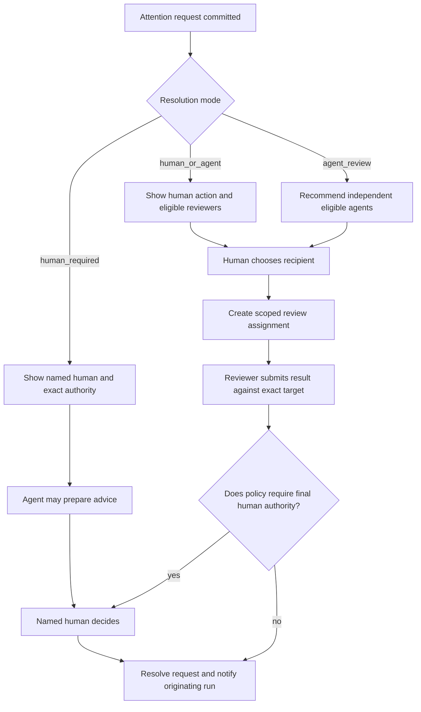

# BFB board UX

The board answers five questions in order:

1. Who is working where, on what?
2. What needs me now?
3. Why does it need me specifically?
4. Can another agent review it instead?
5. Where did agent work and human attention go?

Evidence, raw events, and the immutable run ledger live one level deeper. They support a decision from the board; they do not compete with the decision.

## First viewport

```text
┌ BFB  TENIRA / ALL PROJECTS                    SEARCH   LIVE   TIMO ┐
├ 5 agents active | 2 need Timo | 1 behind | Agent 21h18 | Human 4h06 ┤
├ NEEDS TIMO NOW ─────────────────────────────────────────────────────┤
│ [P0 · BFB MAC · Claude is blocked on your runner approval · APPROVE]│
│ [P1 · BFB CORE · Product choice needed · PASS TO CODEX / DECIDE]    │
├ PROJECTS  ALL  BFB CORE  BFB MAC  BFB CLOUD  ARTIFACTS  OAUTH  →   ┤
├────────────────────┬────────────────────┬────────────────────┬──────┤
│ BFB CORE           │ BFB MAC            │ BFB CLOUD          │ ...  │
│ agent 4h32         │ agent 6h12         │ agent 3h48         │      │
│ human 52m          │ human 1h24         │ human 31m          │      │
│                    │                    │                    │      │
│ [P1 HIGH]          │ [P0 BLOCKING]      │ [P1 HIGH]          │      │
│ Route review       │ Block occupied     │ Replay reconnect   │      │
│ NOW                │ NOW                │ NOW                │      │
│ Needs Timo...      │ Codex is running   │ Checkpoint behind  │      │
│                    │ lease race tests   │ 18m                │      │
│ [P2 NORMAL]        │ [P2 NORMAL]        │ [P2 NORMAL]        │      │
│ Context versioning │ Runner enrollment  │ OAuth delegation   │      │
│ NOW                │ NOW                │ NOW                │      │
│ Claude is working  │ Waiting for review │ Codex is idle      │      │
└────────────────────┴────────────────────┴────────────────────┴──────┘
```

The board uses project lanes, not status columns. Each lane is one project and contains stacked task cards. State, priority, actor, and next gate live inside the card.

- **Needs Timo Now** is a cross-project action deck above the lanes. It contains at most three P0 or P1 requests that are blocking or due and a `View all` action.
- **Project navigation** is a compact colored rail for all ten projects. It moves focus without replacing normal horizontal scrolling.
- **Project lanes** are 300 to 340px wide. Three to four lanes remain visible on a laptop. Lane headers stay sticky during vertical work.
- **Workload summary** states separate agent work, human work, and the project receiving the most human attention. It never produces a productivity score.
- **Load** remains a dedicated route for full attention analytics. Lane headers show enough agent and human work to answer the daily question without opening it.

The top action deck is a projection of an attention request tied to one task. The underlying task still appears in its project lane with a `Pinned above` anchor and the same task ID. This makes the cross-project view useful without implying duplicate work.

At widths below 1180px, two and a half lanes remain visible. Below 768px, Needs Timo becomes a vertical list and one project lane is visible at a time beneath a project selector. No essential action requires hover or a precision drag gesture.

## Project and priority color

Project identity and task priority use different positions and never compete for the same fill.

- **Project identity** owns the lane header, project swatch, pale task-card tint, 3px full-width card top edge, and project label.
- **Priority** owns a top-right corner flag, an icon shape, and the explicit label `P0 BLOCKING`, `P1 HIGH`, `P2 NORMAL`, or `P3 LOW`.
- **State** is written in the punchline and metadata. Working, waiting, behind, and needs-human do not introduce another card color system.
- **Selection** uses an ink outline and focus ring. It does not recolor the task into a different project or priority.

Every workspace assigns one stable project color from the approved palette. The assignment is stored, visible in project settings, and remains stable across sessions. Color is redundant with the project name and lane position.

### Priority contract

| Priority | Meaning | Top-deck eligibility |
| --- | --- | --- |
| `P0 BLOCKING` | Active work or a critical commitment cannot continue | Always when waiting for the current human |
| `P1 HIGH` | Important near-term work with material consequence | When waiting for the current human and blocking or due |
| `P2 NORMAL` | Default planned work | Only in project lane |
| `P3 LOW` | Parked or opportunistic work | Only in project lane |

Priority is explicit task data. BFB never infers it from provider, tokens, wait age, or model output. A missed commitment is shown separately even when the task has normal priority.

## Task card

The one-line punchline is the strongest line after the title. It states where the task is now using committed semantic state, not a summary scraped from terminal text. `Now` is a neutral label; project identity, priority, and human attention retain their own color channels.

```text
BFB MAC                         P0 BLOCKING
Block launch when checkout is occupied

NOW
Claude is blocked on your runner approval.

CLAUDE / WAITING 22M
Mac Studio / bfb-main@76ab1f9

Agent 1h05  Human 12m  Wait 22m

WHY TIMO
You own this runner.

[Review request] [Approve]
```

Card order:

1. project identity and priority flag;
2. task title and task ID;
3. `Now` punchline;
4. actor, truthful activity, and sanitized checkout;
5. next gate or explicit behind reason;
6. agent work, human work, elapsed, and waiting as separate values;
7. `Why you` or `Why delegable` when attention exists;
8. one primary action and one safe alternate action.

Example punchlines:

- `Codex is running checkout lease tests. Next: Claude review.`
- `Claude is blocked on your runner approval.`
- `Grok submitted the parser. Codex can review it.`
- `Checkpoint missed by 18m. The agent is still working.`
- `Process alive. No trusted activity for 37m.`

Punchlines use deterministic templates over committed state. They never claim intent, progress, or completion that BFB cannot prove.

## Attention

Attention is grouped by resolution, not by generic priority.

### Only you

Use this group when the request carries authority or knowledge that cannot be delegated under current policy.

```text
ONLY YOU

Approve runner wake
BFB / Block launch when checkout is occupied

Why Timo
You own this runner. Waking it changes who may launch work on your Mac.

Requested by Claude  2m ago
Blocking the run

[Review request] [Deny] [Approve]
```

The reason names the real authority or decision. “Human required” is insufficient.

Examples:

- You own this runner.
- You are the permitted result acceptor.
- This changes workspace policy.
- The acceptance criteria conflict and require a product decision.
- A destructive action requires the named human who initiated the run.

An agent may prepare a recommendation for these requests, but no agent review can satisfy the underlying human authority.

### Agent review works

Use this group when the request needs an independent technical or visual check, but no human-only permission, product decision, credential, or destructive-action approval.

```text
AGENT REVIEW WORKS

Review launch containment diagram
BFB / C09 launch orchestration

Why this can move
No human permission or product decision is required. The review is bound to artifact v3.

Recommended: Codex
Knows C09  Project access  Idle now  Not the author

[Pass to Codex] [Choose reviewer] [Keep it]
```

Passing work creates a scoped review assignment bound to the exact task, code revision, artifact version, configuration snapshot, and acceptance criteria. It does not send a chat message or grant broader project access.

The authoring run cannot review itself. A suggested reviewer must:

- have project and target access;
- be allowed by workspace, project, and repository policy;
- have the requested review capability;
- be independent from the authoring run;
- be available on a compatible runner or remote review path;
- receive only the context required for the review.

Recommendations are suggestions. BFB never silently routes work or widens authority.

### Top-deck ordering

The Needs Timo deck is deterministic and contains at most three requests:

1. explicit priority: P0, then P1;
2. blocking before non-blocking;
3. earliest response target;
4. oldest unresolved request;
5. stable task ID.

The deck includes only requests the current person can resolve. Delegable P0 or P1 work may appear when that person must choose the reviewer; an agent-review assignment already in progress stays in its project lane.

### Waiting on someone else

This group keeps blocked work visible without telling the current viewer to act.

```text
WAITING ON GEORGE

Choose nullable supplier policy
BFB Cloud / supplier schema migration

Why George
George owns the data contract. Grok cannot continue without the decision.

Waiting 42m

[Open task] [Remind George]
```

External systems that cannot be influenced by a person belong in `Waiting`, not Attention. `CI is still running` is a state, not a request.

### Attention row anatomy

Every attention row contains:

1. resolution label: `Only you`, `Human or agent`, or `Agent review works`;
2. request title and plain-language question;
3. project, task, and originating actor;
4. exact `Why you` or `Why delegable` explanation;
5. blocking or non-blocking state;
6. request age and project response target, if one exists;
7. target revision or artifact version;
8. the smallest safe set of actions.

Critical permission and destructive-action requests contain no joke. Empty and low-risk states may carry one dry line, such as: `Nothing needs you. Enjoy the suspicious silence.`

## Attention routing contract

An attention request needs explicit routing fields. The UI must not infer these from prose.

| Field | Values | Meaning |
| --- | --- | --- |
| `resolution_mode` | `human_required`, `human_or_agent`, `agent_advises_human`, `agent_review`, `information_only` | Who may satisfy the request |
| `required_authority` | named permission or `none` | Why a particular human is required |
| `required_capability` | review capability or `none` | What a delegated reviewer must be able to do |
| `blocking` | boolean | Whether the originating run may continue |
| `target` | task, revision, artifact version, config snapshot | Exact object being decided or reviewed |
| `response_target` | optional duration or date | When the request becomes behind |
| `origin` | run, actor, source, committed time | Provenance of the request |
| `delegation_policy` | allowed profiles, independence, maximum depth | Safe routing boundary |



Delegation depth is one in v0.1. A review agent cannot pass the same review to another agent. This prevents invisible chains and keeps responsibility legible.

A request that combines technical review with privileged approval is split into two linked requests. An agent recommendation never converts human-only authority into an answered request.

## Project lanes

The default board is a horizontal set of project lanes because the primary question is where work is happening. Each task stays inside one project lane regardless of state. Completed work moves to Latest Work; it does not become a Done column.

Lane width is 300 to 340px with a 16px gap. The page owns vertical scroll. The project canvas owns one native horizontal scroll with a visible scrollbar. Individual lanes never create vertical scroll traps.

### Lane header

```text
BF  BFB MAC
5 open  2 active  1 waiting  1 behind
Agent 6h12  Human 1h24
Next commitment: runner threat model accepted by 16:00
```

The header carries the project color, code, full name, direct counts, separate work totals, and next explicit commitment. It never shows health, utilization, or completion percentage.

### Project navigation

A sticky navigator sits directly above the lanes. Each entry shows project code, name, open count, exception count, and project-color underline.

- Selecting a project aligns its lane to the left edge.
- Previous and next buttons move exactly one lane.
- Trackpad horizontal gestures remain native; vertical wheel input is never hijacked.
- A visible scrollbar and searchable `Jump to project` control keep project ten reachable.
- The active project persists in the URL and restores after returning from detail.
- Cards cannot be dragged between lanes. Moving a task to another project is an explicit audited action.

### Task ordering

Order is deterministic:

1. explicit priority: P0, P1, P2, then P3;
2. within priority: waiting on human, behind, working or reviewing, ready, queued, then idle;
3. earliest due time;
4. oldest unresolved attention;
5. stable task creation time.

Live updates never move a focused, hovered, or expanded card. Reordering waits until interaction ends, then announces the move.

### Working and presence

- `Working` requires an open normalized activity interval.
- A live process at a prompt is `Idle`, not working.
- A connected runner proves connectivity, not work.
- A stale heartbeat becomes `Signal stale` or `Runner offline`; it does not change the result.
- Human `Reviewing` requires an explicit review timer or active review interaction. A browser tab is not labor.

### Behind and stale

`Behind` is reserved for an explicit missed commitment. All four conditions must be true:

1. a stored commitment exists;
2. it has an explicit due time;
3. no committed event satisfies it;
4. the due time has passed.

A commitment may describe a target date, dependency resolution, review response, attention response, promised checkpoint, or planned start. BFB prints the missed commitment and elapsed delay.

Signal age is separate:

- `No activity for 47m` is stale activity information.
- `Runner offline for 12m` is connectivity information.
- Neither becomes behind unless a declared expectation was missed.

The board always prints the reason: `Review target missed by 42m`, `Blocked by BFB-102`, or `Planned start missed by 1d`. A red label without a reason is not useful.

### Board interactions

- Selecting a task card opens a side sheet without losing lane position.
- The sheet order is current truth, attention and handoff, evidence, measurements, then event ledger.
- `Return to session`, `Open attention`, `Pass review`, and `Start run` are contextual actions.
- Global filters are scope, project, actor, state, and time range. v0.1 has no configurable columns or custom workflow builder.
- Project navigation uses Left, Right, Home, and End. Up and Down move through cards after a lane receives focus. Enter opens; Escape restores the invoking card. Skip links reach attention, projects, and project search.

## Work and attention measurements

The board never merges unlike measurements into one productivity score.

### Agent work

- active work intervals;
- process elapsed time;
- waiting for human;
- waiting for external dependency;
- provider-reported, stream-derived, estimated, or unavailable token usage.

### Human work

- explicit review timer;
- committed review interaction time;
- decision and response events;
- attention response latency, shown separately from work time.

Browser-open time, cursor movement, and absence of intervention are not human work.

### Attention Load

The Load route answers `Where did human attention go?` with ranked horizontal bars, not a pie chart. The first viewport carries only the separate agent and human totals plus the project receiving the most human attention.

Default 7-day views:

1. **Human attention by project** in minutes or hours.
2. **Human attention by reason**: review, product decision, access, destructive action, clarification.
3. **Agent active work by project** in hours.
4. **Top attention sinks** with task and reason.

Example:

```text
HUMAN ATTENTION / 7 DAYS
BFB          1h 24m  ███████████
Kansa          52m   ███████
FoodSafe       31m   ████

TOP SINK
Runner access decisions
1h 02m across 4 requests

AGENT ACTIVE  21h 18m
HUMAN WORK     4h 06m
ATTENTION WAIT 6h 42m
```

The totals are factual workload, not a claim that more agent hours or fewer human hours is automatically better. Clicking a bar returns to the same project lanes and Needs Timo projection filtered to the underlying records.

## Latest Work

Latest Work sits below the first viewport and is grouped by project. It summarizes committed results, reviews, code revisions, artifacts, and decisions. It never scrapes terminal prose into a success story.

Each item answers:

- what changed;
- who did it;
- which task and run it belongs to;
- whether it is waiting for agent review, human review, or acceptance;
- how to open the supporting evidence and ledger.

## Landing-page product frame

Every landing direction uses the same board fixture. The hero product frame must show:

- a cross-project Needs Timo deck above the work;
- at least three project lanes with stable, labeled project colors;
- stacked task cards whose fixed top-right priority markers remain distinct from project color;
- at least three named agents or humans doing named work;
- a strong one-line `Now` punchline on every visible task card;
- one non-delegable `Only you` request with an exact reason;
- one `Agent review works` request with a recommended recipient;
- one explicit behind reason;
- separate agent and human work values;
- one ranked human-attention hotspot.

The landing headline can be funny. The board cannot be vague.
