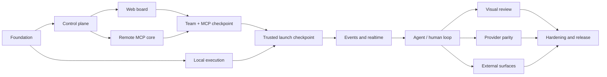
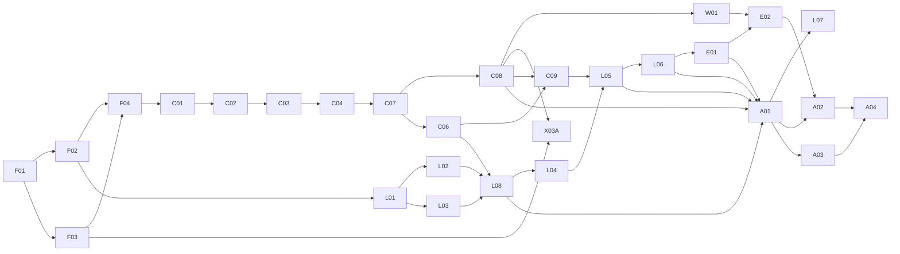

# BFB v0.1 work packages

This plan turns the [v0.1 architecture](../../ARCHITECTURE.md) into independently reviewable implementation units. A package is complete only when its observable outcome, automated acceptance checks, failure-path tests, and handoff evidence all exist.

The default is sequence over concurrency. Parallel work is allowed only where this document names a stable contract and non-overlapping ownership boundary.

The program contains 42 work packages and nine integration checkpoints. Package IDs are stable identifiers, not a claim that packages execute in numeric order.

## Delivery rules

- Build one vertical capability at a time. Infrastructure-only packages must unlock a named integration checkpoint.
- Treat `protocol/schema`, D1 migrations, authorization policy, `WorkspaceHub` commands, local RPC, and the provider interface as shared contracts.
- Add only schema and extension points consumed by the current package. Deferred architecture remains deferred.
- Every retry path, authorization boundary, state transition, and degraded state named in a package needs a negative test.
- Package handoff includes exact commands, fixtures, migration head, known limitations, and evidence. “Works locally” is not a handoff.
- Any change to an architectural invariant requires an ADR before implementation continues.
- Production deployment and other shared-state rollout remain separately confirmed operations. Local and staging verification belong to the package.

## Status model

`planned` → `ready` → `in_progress` → `review` → `done`

- `ready`: every dependency is done, consumed/produced contracts are recorded and versioned, the exact test target and evidence-manifest path are assigned, acceptance is executable, and no decision remains implicit.
- `review`: implementation and evidence exist, but downstream work must not treat them as final.
- `done`: acceptance passes from a clean checkout and the handoff is committed.
- A package is marked `blocked` only when the same durable blocker has survived the required investigation and cannot be worked around safely.

Package metadata is canonical in each package file. The marked graph and index below are generated from that metadata.

## Program shape

The first useful checkpoint is the authenticated team board plus a narrow delegated remote MCP task loop. The first execution alpha remains the complete chain from a task card to an exact local Claude session, truthful live state, a human attention round trip, and explicit result submission.

## Dependency graph

```mermaid
flowchart TD
    subgraph Foundation["Foundation"]
        F01["F01 Repository foundation"]
        F02["F02 Wire contracts and test doubles"]
        F03["F03 Cloudflare application substrate"]
        F04["F04 D1 tenant persistence and migrations"]
    end
    subgraph Controlplane["Control plane"]
        C01["C01 WorkspaceHub command and event kernel"]
        C02["C02 Human identity and sessions"]
        C03["C03 Passkey enrollment and step-up"]
        C04["C04 Workspace authorization"]
        C05["C05 Human device and CLI credentials"]
        C06["C06 Runner identity, grants, and tokens"]
        C07["C07 Projects, repository identity, and policy"]
        C08["C08 Tasks, runs, context, and work APIs"]
        C09["C09 Durable launch orchestration"]
    end
    subgraph Localexecution["Local execution"]
        L01["L01 Go daemon and CLI kernel"]
        L02["L02 Exact checkout registry"]
        L03["L03 Provider adapter kit"]
        L04["L04 SwiftUI macOS application"]
        L05["L05 Terminal execution supervisor"]
        L06["L06 Hook journal and offline inbox"]
        L07["L07 Claude Code reference adapter"]
        L08["L08 Runner enrollment and channel client"]
    end
    subgraph Webandrealtime["Web and realtime"]
        W01["W01 Authenticated app and Work surface"]
        W02["W02 Runner and launch operations UI"]
        E01["E01 Event ingestion, projection, and replay"]
        E02["E02 Browser realtime, timeline, and presence"]
    end
    subgraph Agentandhumanloop["Agent and human loop"]
        A01["A01 Run-scoped local MCP and context"]
        A02["A02 Human attention workflow"]
        A03["A03 Result submission and acceptance"]
        A04["A04 Measurements and provenance"]
    end
    subgraph Visualreview["Visual review"]
        V01["V01 Artifact storage state machine"]
        V02["V02 Isolated artifact viewer"]
        V03["V03 Immutable artifact review"]
    end
    subgraph Providerparity["Provider parity"]
        P01["P01 Codex adapter"]
        P02["P02 Grok adapter"]
    end
    subgraph Externalsurfacesandoperations["External surfaces and operations"]
        X01["X01 Actionable notifications"]
        X02["X02 Human CLI parity"]
        X03["X03 Remote MCP parity extensions"]
        X03A["X03A Remote OAuth MCP core"]
        X04["X04 GitHub evidence integration"]
        X05["X05 Operations, audit, and retention"]
    end
    subgraph Golive["Go-live"]
        G01["G01 Integrated adversarial hardening"]
        G02["G02 Release, self-hosting, and recovery"]
    end

    F01 --> F02
    F01 --> F03
    F02 --> F04
    F03 --> F04
    F02 --> C01
    F03 --> C01
    F04 --> C01
    C01 --> C02
    F03 --> C02
    C01 --> C03
    C02 --> C03
    C01 --> C04
    C02 --> C04
    C03 --> C04
    C01 --> C05
    C02 --> C05
    C04 --> C05
    C07 --> C05
    C01 --> C06
    C03 --> C06
    C04 --> C06
    C07 --> C06
    F02 --> C06
    C01 --> C07
    C04 --> C07
    C01 --> C08
    C04 --> C08
    C07 --> C08
    C01 --> C09
    C04 --> C09
    C06 --> C09
    C07 --> C09
    C08 --> C09
    F01 --> L01
    F02 --> L01
    F02 --> L02
    L01 --> L02
    F02 --> L03
    L01 --> L03
    C06 --> L04
    L01 --> L04
    L08 --> L04
    C09 --> L05
    L01 --> L05
    L02 --> L05
    L03 --> L05
    L04 --> L05
    L08 --> L05
    F02 --> L06
    L01 --> L06
    L03 --> L06
    L05 --> L06
    L08 --> L06
    A01 --> L07
    E01 --> L07
    L03 --> L07
    L05 --> L07
    L06 --> L07
    C06 --> L08
    F02 --> L08
    L01 --> L08
    L02 --> L08
    L03 --> L08
    C02 --> W01
    C03 --> W01
    C04 --> W01
    C08 --> W01
    F03 --> W01
    C03 --> W02
    C06 --> W02
    C09 --> W02
    L03 --> W02
    L04 --> W02
    L05 --> W02
    L08 --> W02
    W01 --> W02
    C01 --> E01
    C04 --> E01
    C06 --> E01
    C08 --> E01
    C09 --> E01
    L06 --> E01
    E01 --> E02
    W01 --> E02
    C08 --> A01
    E01 --> A01
    L01 --> A01
    L03 --> A01
    L05 --> A01
    L06 --> A01
    L08 --> A01
    A01 --> A02
    E02 --> A02
    W01 --> A02
    A01 --> A03
    C08 --> A03
    E01 --> A03
    W01 --> A03
    A02 --> A04
    A03 --> A04
    E01 --> A04
    W01 --> A04
    A01 --> V01
    C01 --> V01
    C04 --> V01
    F03 --> V01
    C01 --> V02
    V01 --> V02
    W01 --> V02
    A03 --> V03
    A04 --> V03
    V02 --> V03
    W01 --> V03
    A01 --> P01
    A03 --> P01
    E01 --> P01
    L03 --> P01
    L05 --> P01
    L06 --> P01
    L07 --> P01
    A01 --> P02
    A03 --> P02
    E01 --> P02
    L03 --> P02
    L05 --> P02
    L06 --> P02
    L07 --> P02
    A02 --> X01
    A03 --> X01
    E02 --> X01
    L04 --> X01
    A02 --> X02
    A03 --> X02
    C05 --> X02
    C06 --> X02
    C07 --> X02
    C08 --> X02
    C09 --> X02
    L01 --> X02
    L02 --> X02
    L03 --> X02
    L05 --> X02
    L06 --> X02
    L07 --> X02
    L08 --> X02
    P01 --> X02
    P02 --> X02
    V01 --> X02
    V02 --> X02
    A01 --> X03
    A02 --> X03
    A03 --> X03
    V01 --> X03
    X03A --> X03
    C01 --> X03A
    C02 --> X03A
    C03 --> X03A
    C04 --> X03A
    C07 --> X03A
    C08 --> X03A
    F03 --> X03A
    A03 --> X04
    C01 --> X04
    C03 --> X04
    C04 --> X04
    C07 --> X04
    E01 --> X04
    F03 --> X04
    C01 --> X05
    C03 --> X05
    C04 --> X05
    C06 --> X05
    C07 --> X05
    C08 --> X05
    C09 --> X05
    E01 --> X05
    L01 --> X05
    L02 --> X05
    L03 --> X05
    L08 --> X05
    V01 --> X05
    W01 --> X05
    X01 --> X05
    X04 --> X05
    A04 --> G01
    E02 --> G01
    L07 --> G01
    P01 --> G01
    P02 --> G01
    V03 --> G01
    W02 --> G01
    X01 --> G01
    X02 --> G01
    X03 --> G01
    X04 --> G01
    X05 --> G01
    F03 --> G02
    F04 --> G02
    G01 --> G02
    L04 --> G02
    L08 --> G02
    X02 --> G02
    X05 --> G02
```

<!-- bfb:work-package-graph:start -->

<!-- bfb:work-package-graph:end -->

Every arrow is a direct `Requires` edge; transitive edges are omitted. F01 makes this graph and the package index generated output and fails CI on drift. Until F01 exists, the same relationship is checked mechanically before roadmap changes are committed.

## Package index

<!-- bfb:work-package-index:start -->

### Foundation

| ID | Package | Status | Risk |
| --- | --- | --- | --- |
| F01 | [Repository foundation](WP-F01-repository-foundation.md) | `in_progress` | Medium |
| F02 | [Wire contracts and test doubles](WP-F02-wire-contracts.md) | `planned` | High |
| F03 | [Cloudflare application substrate](WP-F03-cloud-substrate.md) | `planned` | High |
| F04 | [D1 tenant persistence and migrations](WP-F04-tenant-persistence.md) | `planned` | Very high |

### Control plane

| ID | Package | Status | Risk |
| --- | --- | --- | --- |
| C01 | [WorkspaceHub command and event kernel](WP-C01-command-kernel.md) | `planned` | Very high |
| C02 | [Human identity and sessions](WP-C02-human-identity.md) | `planned` | High |
| C03 | [Passkey enrollment and step-up](WP-C03-passkey-step-up.md) | `planned` | High |
| C04 | [Workspace authorization](WP-C04-workspace-authorization.md) | `planned` | Very high |
| C05 | [Human device and CLI credentials](WP-C05-human-device-credentials.md) | `planned` | High |
| C06 | [Runner identity, grants, and tokens](WP-C06-runner-enrollment-channel.md) | `planned` | Very high |
| C07 | [Projects, repository identity, and policy](WP-C07-work-domain.md) | `planned` | High |
| C08 | [Tasks, runs, context, and work APIs](WP-C08-work-records.md) | `planned` | High |
| C09 | [Durable launch orchestration](WP-C09-launch-orchestration.md) | `planned` | Very high |

### Local execution

| ID | Package | Status | Risk |
| --- | --- | --- | --- |
| L01 | [Go daemon and CLI kernel](WP-L01-daemon-kernel.md) | `planned` | High |
| L02 | [Exact checkout registry](WP-L02-checkout-registry.md) | `planned` | High |
| L03 | [Provider adapter kit](WP-L03-provider-kit.md) | `planned` | High |
| L04 | [SwiftUI macOS application](WP-L04-macos-app.md) | `planned` | High |
| L05 | [Terminal execution supervisor](WP-L05-terminal-supervisor.md) | `planned` | Very high |
| L06 | [Hook journal and offline inbox](WP-L06-hook-journal.md) | `planned` | Very high |
| L07 | [Claude Code reference adapter](WP-L07-claude-adapter.md) | `planned` | High |
| L08 | [Runner enrollment and channel client](WP-L08-runner-channel-client.md) | `planned` | Very high |

### Web and realtime

| ID | Package | Status | Risk |
| --- | --- | --- | --- |
| W01 | [Authenticated app and Work surface](WP-W01-app-shell.md) | `planned` | Medium |
| W02 | [Runner and launch operations UI](WP-W02-launch-operations-ui.md) | `planned` | High |
| E01 | [Event ingestion, projection, and replay](WP-E01-event-ingest-replay.md) | `planned` | Very high |
| E02 | [Browser realtime, timeline, and presence](WP-E02-browser-realtime.md) | `planned` | High |

### Agent and human loop

| ID | Package | Status | Risk |
| --- | --- | --- | --- |
| A01 | [Run-scoped local MCP and context](WP-A01-local-mcp-context.md) | `planned` | Very high |
| A02 | [Human attention workflow](WP-A02-attention.md) | `planned` | High |
| A03 | [Result submission and acceptance](WP-A03-results.md) | `planned` | High |
| A04 | [Measurements and provenance](WP-A04-measurements.md) | `planned` | High |

### Visual review

| ID | Package | Status | Risk |
| --- | --- | --- | --- |
| V01 | [Artifact storage state machine](WP-V01-artifact-storage.md) | `planned` | Very high |
| V02 | [Isolated artifact viewer](WP-V02-artifact-viewer.md) | `planned` | Very high |
| V03 | [Immutable artifact review](WP-V03-artifact-review.md) | `planned` | High |

### Provider parity

| ID | Package | Status | Risk |
| --- | --- | --- | --- |
| P01 | [Codex adapter](WP-P01-codex-adapter.md) | `planned` | High |
| P02 | [Grok adapter](WP-P02-grok-adapter.md) | `planned` | High |

### External surfaces and operations

| ID | Package | Status | Risk |
| --- | --- | --- | --- |
| X01 | [Actionable notifications](WP-X01-notifications.md) | `planned` | Medium |
| X02 | [Human CLI parity](WP-X02-human-cli.md) | `planned` | High |
| X03 | [Remote MCP parity extensions](WP-X03-remote-mcp.md) | `planned` | Very high |
| X03A | [Remote OAuth MCP core](WP-X03A-remote-mcp-core.md) | `planned` | Very high |
| X04 | [GitHub evidence integration](WP-X04-github.md) | `planned` | High |
| X05 | [Operations, audit, and retention](WP-X05-operations.md) | `planned` | High |

### Go-live

| ID | Package | Status | Risk |
| --- | --- | --- | --- |
| G01 | [Integrated adversarial hardening](WP-G01-system-hardening.md) | `planned` | Very high |
| G02 | [Release, self-hosting, and recovery](WP-G02-release-self-host.md) | `planned` | Very high |

<!-- bfb:work-package-index:end -->

## Integration checkpoints

| Checkpoint | Packages | Required demonstration |
| --- | --- | --- |
| IC-0 — Platform | F01–04, C01 | Clean checkout builds; local Cloudflare stack deploys; schema/codegen, D1 migration, tenant-repository, and hub-serialization checks pass |
| IC-1 — Team workspace + remote MCP | C02–04, C07–08, W01, X03A | Three humans have different workspace/project rights, can operate isolated task/run/context records, and can delegate the bounded task loop to a remote MCP client |
| IC-2 — Trusted Mac | C06, L01–04, L08 | A Mac enrolls, reconnects, and reports a verified checkout/provider capability without gaining authority outside its grants |
| IC-3 — Provider-neutral tracked launch | C09, L05, W02 | A card launches the fake provider in the exact checkout; mismatch, occupancy, expiry, lock, revocation, run controls, and containment fail safely |
| IC-4 — Truthful live run | L06, E01–02 | Disconnects, duplicate hooks, concurrent runs, daemon failure, heartbeat gaps, and replay neither lose nor misattribute accepted events |
| IC-5 — Claude human loop | A01–04, L07 | Claude gets scoped context, requests attention, receives an answer, submits a result, and exposes honest usage provenance without false completion |
| IC-6 — Visual review | V01–03 | Mermaid and hostile self-contained HTML publish and review without trusted-origin access or inherited approval |
| IC-7 — Provider/external parity | P01–02, X01–05 | Providers degrade honestly; notifications, CLI, OAuth MCP, GitHub, audit, and retention pass their failure suites |
| IC-8 — Release | G01–02 | Blank-account self-host and signed Mac install reproduce the same golden flow with recovery evidence |

IC-3 deliberately proves launch authority, PTY behavior, locking, controls, and containment with the deterministic fake provider. The architecture’s user-visible first-launch claim is completed at IC-5, when L07 repeats that path with a supported real Claude version, trusted session binding, local MCP, replay, attention, and explicit result submission.

## Safe parallel windows

The recommended plan uses concurrency only where it buys real time without contract churn:

1. After F01, F02 and F03 can run together. F04 waits for both.
2. The selected web-first tranche continues F04 → C01 → C02 → C03 → C04 → C07 → C08 → W01 → X03A. W01 and X03A may run together only after C08's shared commands freeze.
3. After F02, L01 may proceed while the web-first tranche continues; after L01, L02 and L03 can run together.
4. C05, C06, and C08 are logically separate after C07 but share D1/hub surfaces, so sequence their migrations. Once C06 and C08 are stable, C09 and L08 can run together against F02 fixtures. L04 follows L08; L05 follows C09, L04, and L08; L06 follows L05.
5. After IC-5, P01 and P02 own provider-local descriptors/directories and can run together. The V01 → V02 → V03 chain can overlap provider work because it owns separate artifact surfaces.
6. X01, X03, and X04 can run together after their dependencies freeze. X02 waits for provider parity; X05 waits for X01 and X04.

Everything else is sequential by default. In particular, do not parallelize packages that both change D1 migrations, `WorkspaceHub`, auth middleware, the root daemon dispatcher, local SQLite migrations, or shared generated contracts.

## Selected alpha dependency spine

The full graph above is authoritative. This smaller diagram highlights the web/MCP checkpoint and the major joins that follow it:

This is a selected dependency spine, not a complete closure or time estimate. We should not skip security or replay packages to make a demo appear sooner.

## Execution protocol

Before starting a package:

1. Move it to `ready` only after every dependency is `done`.
2. Fill the [package template](TEMPLATE.md) contract section, exact clean-checkout test target, and stable evidence-manifest path; freeze every consumed contract.
3. Resolve every package decision; add an ADR if the answer changes the architecture.
4. Record consumed schema versions, migration head, and the previous checkpoint command.
5. Confirm the assigned feature branch was created from current `main`; sequential packages in one approved goal may use sequential commits on that branch.
6. Run the previous checkpoint before editing.

At handoff:

1. Run package acceptance and every earlier checkpoint affected by the change.
2. Attach the evidence named in the package.
3. Update generated contracts and prove zero drift.
4. Record only real limitations; never leave silent degraded behavior.
5. Merge only when the next package can start without private local knowledge.

The [acceptance matrix](ACCEPTANCE.md) maps the architecture’s release gates to the package that creates and owns each automated proof.

## Optional early-release cuts

All packages remain in the v0.1 architecture. X03A is part of the web/MCP checkpoint; X03 parity extensions are not. Other clean early cuts are X04 GitHub evidence, broad X02 CLI parity, browser push inside X01, and secondary artifact renderers. Exact-checkout containment, passkey step-up, tenant isolation, offline replay, attention, provenance, and artifact sandboxing are not sensible cuts from the execution alpha; they are its trust boundary and differentiation.
