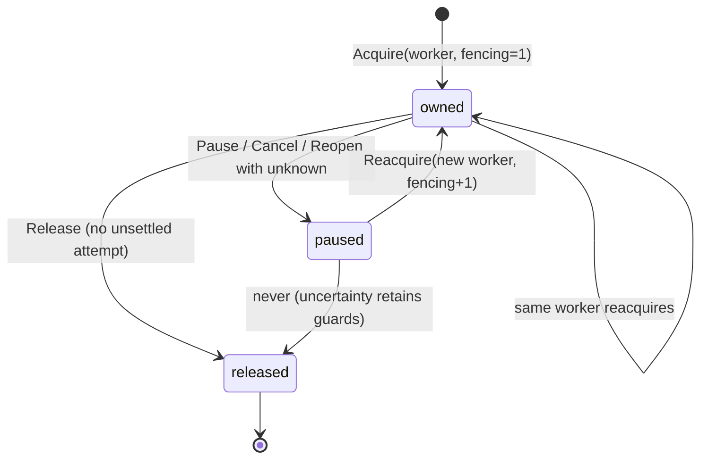
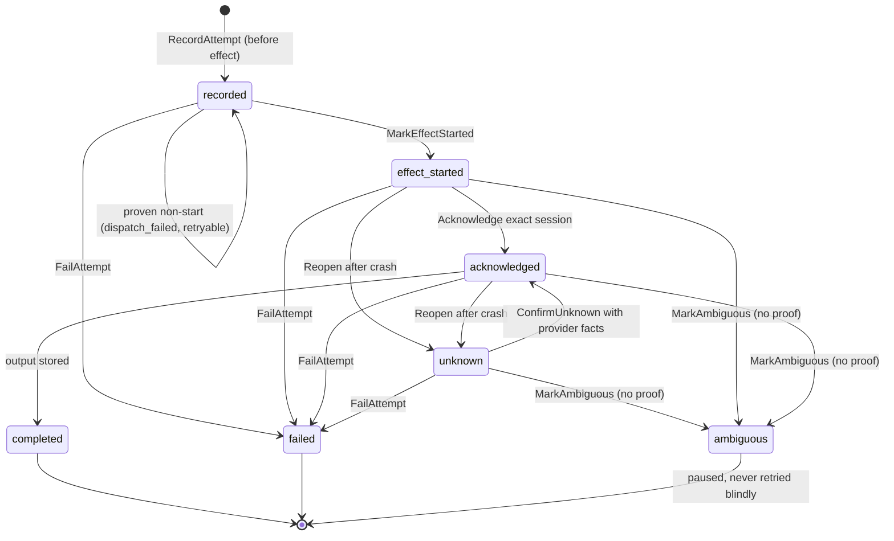

# WP-D02 fencing and delivery state

Ownership is one row per discussion participant slot in local migration 012.
Fencing advances only through `Reacquire` after `Reopen`; the crashed
generation stays stale and its writes fail with `fencing_stale`.

Duplicate workers fail with `ownership_conflict`, including across process
restarts against the same file. A released slot needs reconcile, not a fresh
acquire (`recovery_pending`).

Attempts chain discussion, slot, ordinal, turn, delivery, and idempotency key.
Each dispatch records its attempt before the possible provider effect.

The first acknowledgement binds the exact observed session immutably.
`session_conflict` (competing ID), `session_busy` (another participant's
session), and `session_mismatch` (wrong continuation or malformed identity)
all fail without advancing state.
